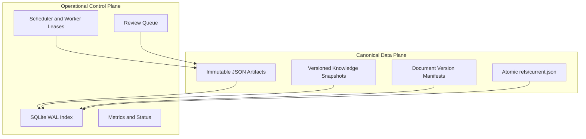
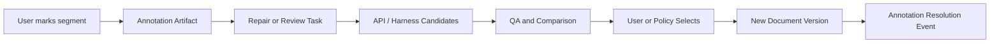

# Translation System Design

> 状态：分阶段实施中。DocumentRevision/Segment、业务 Schema、fixture/golden、source adapter、
> bilingual shadow renderer、legacy candidate import、translate task export/result import、
> candidate deterministic QA、Sharded Artifact Store(#54)、DocumentVersion v2 + 保守选择策略(#50)
> 已进入主干；current ref 发布(原子 CAS)与端到端 slice 已贯通；SQLite 投影(#55)、knowledge/实体库(#83)均已落地；repair 闭环尚未完成。
>
> 当前可执行命令仍以 [`../README.md`](../README.md) 为准；近期实现顺序与组件状态以
> [`../../../docs/PROJECT_STATUS.md`](../../../docs/PROJECT_STATUS.md) 为准。

## 1. 目标

把现有“下载 -> 翻译 -> 修复/清理 -> 打包”的脚本流水线演进为一个单机优先、可恢复、可审计的翻译工作区系统：

- 同时支持 OpenRouter、OpenAI、vLLM、MLX 等批量 API 路线。
- 同时支持 Codex、Claude Code、Cursor 等高质量 Agent harness。
- 每个 segment 可以保留多个候选译文，不覆盖历史。
- 用户或高质量 Agent 可以比较、选择、编辑候选。
- 用户可以标记某句话有问题，并触发定向 review / repair。
- 保持单篇内部的人名、称谓、语气和上下文一致。
- 保持同作者、同系列和跨文本的实体与术语一致。
- QA 和 repair 非破坏性：新结果只有在明确更好时才成为选中版本。
- 所有发布物都可以追溯到确定的 source revision、candidate、规则快照和选择决策。

这不是分布式平台设计。合理目标是：

- 文件系统保存可移植、可审阅的规范工件。
- SQLite/WAL 提供本机索引、查询、并发领取和恢复。
- Makefile 与管理脚本保持统一入口。
- 未来需要远程 worker 时，再在相同任务协议上增加调度后端。

## 2. 核心决策

### 2.1 JSON 是业务工件，SQLite 是运行索引

JSON 与 SQLite 不做二选一。

JSON 保存需要长期保留和跨工具交换的业务事实：

- 规范化文档及 source revision
- segment
- 候选译文
- QA finding 和 evaluation
- 用户 annotation
- entity / terminology 快照
- 文档版本和发布 manifest
- Agent job / result bundle

SQLite 保存可重建或短生命周期的数据：

- 对 JSON 工件的查询索引
- 当前 review queue
- worker lease、心跳和 retry
- run / stage 的实时状态
- 聚合后的 token、成本、耗时指标
- 当前 ref 的快速查询缓存

约束：

1. 不允许某个长期业务事实只存在于 SQLite。
2. SQLite 删除后必须可以通过 `rebuild-index` 从 JSON 工件重建。
3. worker lease 等纯调度状态不要求写入 JSON。
4. JSON 对象应小而独立，禁止维护一个不断被并发改写的巨大 `workspace.json`。
5. 长期工件优先不可变；“当前选中版本”使用小型 ref 文件原子更新。

### 2.2 模型和 Agent 都是 Candidate Producer

OpenRouter API、本地 vLLM/MLX、Codex、Claude Code、Cursor、人工编辑都通过统一结果协议生产 candidate。

它们无权直接：

- 覆盖现有 candidate
- 修改已发布版本
- 修改原始输入
- 绕过 QA 将结果发布
- 直接写 canonical workspace

结果必须先经过 schema 校验、来源校验、QA 和选择策略，再由系统导入。

### 2.3 发布物是派生结果

`*_bilingual/`、`*_zh/`、合并文本和 EPUB 等都是 renderer 根据某个不可变 `DocumentVersion` 生成的派生物。

它们不再承担：

- checkpoint
- repair 数据库
- QA 真相源
- candidate 历史

因此发布目录可以随时删除并从版本 manifest 重建。

### 2.4 Repair 永远生成候选，不原地改写

repair 的输入是：

- 当前选中 candidate
- QA findings
- 用户 annotation
- 相关上下文与知识快照

repair 的输出是新的 candidate。旧 candidate 永远保留。

### 2.5 QA 是证据，不是“质量总分”

确定性 QA 能证明候选存在或不存在某类可机械检测的问题，但不能证明语义准确性。

因此：

- `error_count` 只能用于展示、过滤和趋势统计，不能单独定义“最佳候选”。
- “没有假名/拒绝模板”只表示候选通过结构性门槛，不表示它优于当前译文。
- `same_as_source`、`kana_residue` 等规则存在专名、数字、拟声词等假阳性，选择策略必须保留 finding code，
  不能只比较总数。
- 多个候选都通过硬规则但文本不同，默认进入 `review_required`，不能用 `candidate_id` 排序强行裁决。
- 自动 repair 只能在 challenger 相对 incumbent **严格改善且不引入新风险**时替换。

### 2.6 推荐与提交分离

候选比较分成两个动作：

1. `recommend_selection` 读取 candidate、evaluation、annotation 和 incumbent，输出结构化建议：
   `select_challenger` / `keep_incumbent` / `review_required`。
2. `build_document_version` 只接收已经明确的 selection decision，创建不可变版本。

推荐器无权直接更新 `refs/current.json`。版本创建也不等于发布；发布仍需显式 ref 更新。

### 2.7 Artifact Store 是缺失的核心边界

当前已落地模块主要是纯函数，legacy/result importer 仍由调用方传任意 `store_dir`。在接入批量生产前，
必须增加统一 `ArtifactStore`：

- 按 artifact kind 和 ID 提供 `put/get/exists`。
- 写入时执行 schema 与跨工件引用校验。
- 使用临时文件、fsync、原子 rename，禁止同 ID 不同内容覆盖。
- 统一 document/workspace 路径，不让每个 CLI 自行决定目录。
- 后续 SQLite 只索引 Artifact Store，不成为第二个写入真相源。

纯领域函数可以先于 Artifact Store 实现和测试，但任何“发布/current ref/批量 repair”功能不得绕过它。

**规模与身份（2026-06-13 决策，Claude Code × Codex 收敛于 Issue #52/#54 评论）**：当前“一个 candidate
一个 JSON 文件 + legacy/result 两套不一致 ID”不可扩展——单作者 momizi813 按现有派生目录导入即约 5.5 万
candidate。据此固定:

- **Candidate / Attestation 二分**：Candidate 升级为 **v3，只保留可由内容确定、不随第二次观察变化的字段**
  （`candidate_id, document_id, revision_id, segment_id, source_hash, normalization_version, text`）。
  `producer / provenance / purpose / parent_candidate_id / created_at` 全部移入 **append-only Attestation**
  （`parent_candidate_id` 尤其不能固化在共享 Candidate 上——相同文本可从不同 parent 独立生成）。
- **内容寻址身份**：`candidate_id = sha256({identity_version, revision_id, segment_id, source_hash,
  normalization_version, normalized_text})`，完整 64-hex。Attestation ID 同样确定性派生（同 Result 重放不新增）。
  效果:同一句被多 producer 译成相同文本 → 一个 Candidate + 多条 Attestation，**文本等价自动去重**。
- **normalization_version=1 必须 display-preserving**：仅 去尾随空白 + Unicode NFC，不折叠内部空白、不改
  标点/引号；`Candidate.text` 存归一化后文本，且 == 可直接渲染的译文（否则去重虽对、渲染会偏离原译）。
- **按文档分片 + 原子批写**：按安全路径 `store/<kind>/<provider>/<creator_id>/<post_id>.jsonl`（不把含 `:`
  的 document_id 当文件名）落 append-only JSONL，文件数 = 文档数（momizi813≈128）而非 candidate 数。
  `put_many(document_id, artifacts)`:锁 shard → 读一次建 ID map → 校验 → 写全量临时 shard → fsync +
  atomic rename + dir fsync。**冲突检测保留**:同 ID + 同 canonical payload skip，payload 不同 fatal/quarantine
  （防 normalization 漂移、截断 digest、算法 bug、存储损坏）。
- **SQLite 仅作可重建投影**:写入幂等只凭 JSON 工件成立，不依赖 SQLite；SQLite 丢失可从 JSONL 重建。

落地拆为三步:**#52 Candidate v3 + Attestation → #54 Sharded ArtifactStore + integrity gate + importer 迁移
→ #55 SQLite 投影**（#55 在 vertical slice 之后，不作 DocumentVersion 硬前置）。#50 依赖 #52 的 Candidate v3。

**已落地(2026-06-13,#52)**:Candidate v3 schema(纯内容,`schema_version:3`,字段
`candidate_id/document_id/revision_id/segment_id/source_hash/normalization_version/text`)与
Attestation schema(append-only 来源)已进入主干;`artifact_schemas.candidate_id_v3`(内容寻址 64-hex)、
`normalize_text`(normalization_version=1:NFC + 去尾随空白,display-preserving)与 `attestation_id_for`/
`build_attestation`(确定性派生)已实现;`legacy_import` / `result_import` 已迁移为产出 Candidate v3 + Attestation,
**同译文跨 producer 去重 → 一个 Candidate + 多条 Attestation**。evaluation/document-version/annotation/task
(`existing_candidate_ids`)的 `candidate_id` 引用模式同步收紧为 64-hex。**已落地(2026-06-13,#54)**:`artifact_store.ArtifactStore` 按
`store/<kind>/<provider>/<creator_id>/<source_id>.jsonl` 分片;`put_many(document_id, artifacts)`
按 kind 分组 → flock 锁 shard → 读一次建 id map → 校验(schema + candidate `validate_candidate_identity`)→
冲突检测(同 id 同 payload skip / 不同 payload `StoreConflictError`)→ 写全量临时 + fsync + 原子
rename + dir fsync;幂等仅凭 JSONL。`verify_references(artifact, resolver)` 做 cross-artifact 引用
完整性(candidate↔revision.source_hash、attestation/evaluation→真 candidate、version selection 同
revision/segment),**在写入边界强制执行**:put_many 先锁全部相关 shard、做冲突预检 + integrity
(resolver=现有∪本批 staged∪已提交 shard),全通过后再提交 → **逻辑预检失败不落任何 shard**;含
document_id 的 kind 强制与分片键一致。提交阶段按引用依赖序(被引用者先,COMMIT_ORDER:revision→
candidate→attestation/...)写各 shard:POSIX 多文件 rename 非事务,无法做跨 shard 单原子提交,但
依赖序保证任何物理崩溃前缀都**引用完整、无悬空引用**,缺失的后续工件可幂等重导补齐。不替代
Task/Result stale-envelope 校验。legacy/result importer
已迁移走 store(legacy 连同 DocumentRevision 一并入库;result 导入前要求源 revision 已入库,否则整批
quarantine)。**SQLite 只读投影已落地(#55)**。

## 3. 系统总览

```mermaid
flowchart LR
    A["Pixiv / Fanbox Source"] --> B["Source Adapter"]
    B --> C["Document Revision + Segments"]
    C --> D["Context and Knowledge Resolver"]
    D --> E["Task Planner"]
    E --> F["API Executor"]
    E --> G["Harness Job Exporter"]
    G --> H["Codex / Claude Code / Cursor"]
    H --> I["Harness Result Importer"]
    F --> J["Candidates"]
    I --> J
    J --> K["Deterministic QA"]
    K --> L["Semantic Review / Comparison"]
    L --> M["Selection Policy or Human Choice"]
    M --> N["Document Version"]
    N --> O["Renderer"]
    O --> P["Bilingual / Chinese / Package"]
    K --> Q["Repair Queue"]
    R["User Annotation"] --> Q
    Q --> E
```



### 3.1 数据平面与控制平面



## 4. Workspace 布局

建议目标布局：

```text
tasks/translation/
├── schemas/                         # tracked JSON Schema
├── agent_workflows/                 # tracked harness-neutral instructions
├── config/
│   ├── recipes.json
│   ├── runtimes.json
│   └── source_profiles.json
└── data/
    └── workspaces/<workspace_id>/   # runtime data, git-ignored
        ├── workspace.json
        ├── documents/
        │   └── <document_key>/
        │       ├── revisions/<revision_id>.json
        │       ├── candidates/<candidate_id>.json
        │       ├── evaluations/<evaluation_id>.json
        │       ├── annotations/<annotation_id>.json
        │       ├── annotation_events/<event_id>.json
        │       ├── versions/<version_id>.json
        │       └── refs/current.json
        ├── knowledge/
        │   ├── entities/<entity_id>.json
        │   ├── snapshots/<snapshot_id>.json
        │   └── refs/current.json
        ├── jobs/<job_id>/
        │   ├── task.json
        │   ├── context.json
        │   ├── instructions.md
        │   ├── result.schema.json
        │   └── result.json
        ├── runs/<run_id>/
        │   ├── manifest.json
        │   └── events.jsonl
        ├── rendered/<version_id>/
        └── .index/workspace.db
```

canonical artifact 使用完整对象文件；高频运行事件可以使用 append-only JSONL。JSONL 不能承担需要原子替换的 selection manifest。

`document_id` 包含冒号等逻辑分隔符，不能直接作为跨平台目录名。`document_key` 应使用安全 slug 加 hash，
例如 `pixiv-50235390-12430834-a1b2c3d4`，JSON 内仍保留完整 `document_id`。

工件写入必须：

1. 使用稳定的 canonical JSON 序列化后计算 digest。
2. 写入同目录临时文件。
3. `flush/fsync` 后原子 rename。
4. 不覆盖已存在且 digest 不同的不可变对象。
5. 更新 `refs/current.json` 时使用 expected-parent compare-and-swap，防止两个 reviewer 互相覆盖。
   注意：临时文件 + 原子 rename 本身不能让"检查 expected parent 再替换"成为原子操作——两个
   写入者可能同时通过检查后相互覆盖。CAS 必须在持有互斥的前提下执行：用同目录文件锁
   （`flock`/`O_EXCL` lockfile）或 SQLite 事务把"读 parent → 比较 → rename"包成临界区；
   比较失败者必须放弃写入并走冲突分叉流程，而不是重试覆盖。

canonical JSON 的排序、Unicode 和数字规则必须固定。可采用 RFC 8785/JCS，或在项目内定义并测试等价的
UTF-8、sorted-key、无浮点歧义序列化规则。

## 5. 身份、修订和过期结果

### 5.1 Document ID

`document_id` 标识逻辑文章，不随内容修改：

```text
pixiv:<creator_id>:<novel_id>
fanbox:<creator_id>:<post_id>
```

### 5.2 Document Revision

下载内容或 metadata 改变时生成新的 revision：

```text
revision_id = sha256(canonical_source_payload)
```

revision 固定：

- 原文内容
- 结构化 metadata
- source URL
- source adapter 版本
- segmentation 版本

### 5.3 Segment ID

candidate 必须绑定准确的 source revision。建议：

```text
segment_id = <revision_id>:<ordinal>:<normalized_source_hash_prefix>
```

ordinal 方便阅读，source hash 防止将旧结果错误导入新内容。

segment 是最小翻译、候选选择和 QA 单元，不必严格等于语法上的一句话。第一阶段沿用当前“非空原文行”
最稳妥；后续可以支持段落或句子级 segmentation，但算法版本变化必须产生新 revision。

title、caption、series title、tag 等 metadata 也应表示为带 `kind=metadata.*` 的 segment，复用相同的
candidate/evaluation/version 机制，不再维护第二套 metadata 版本模型。

用户可以对整个 segment 标记问题，也可以在 annotation 中附加 source/translation character span。
span 只是 UI 定位信息，candidate 仍以完整 segment 为提交单位，避免局部替换破坏语法。

如果源文更新：

- 创建新 revision 和新 segment ID。
- 使用显式 `segment_mapping` 关联新旧 revision。
- 完全相同的 segment 可复用 candidate，但必须记录复用来源。
- 不允许仅凭行号自动套用旧 candidate。

### 5.4 Stale Result 防护

导入 API 或 Agent 结果时必须校验：

- `task_id`
- `document_id`
- `revision_id`
- `segment_id`
- `source_hash`
- `context_digest`
- `knowledge_snapshot_id`
- `task_schema_version`

任一不匹配时，结果进入 quarantine，不得自动参与 selection。用户可以选择重新导出任务或显式 rebase。

## 6. 核心数据模型

### 6.1 Document Revision

```json
{
  "schema_version": 1,
  "document_id": "pixiv:50235390:12430834",
  "revision_id": "rev_sha256",
  "source": {
    "provider": "pixiv",
    "creator_id": "50235390",
    "source_id": "12430834",
    "url": "https://example.invalid"
  },
  "metadata": {
    "title": "原始标题",
    "series_id": "123",
    "series_title": "系列名",
    "published_at": "2026-01-01T00:00:00Z"
  },
  "segments": [
    {
      "segment_id": "rev_sha256:000042:sourcehash",
      "ordinal": 42,
      "kind": "body",
      "source_text": "彼女は振り返った。",
      "source_hash": "sha256"
    }
  ]
}
```

### 6.2 Candidate（v3，内容寻址）

Candidate 是**纯内容、不可变、content-addressed** 工件（2026-06-13 / #52 落地，详见 §2.7）。
`candidate_id` 由内容直接派生 → 同 (revision, segment, source_hash, 归一化文本) 必同 id，跨 producer 文本等价去重。
`producer / provenance / purpose / parent_candidate_id / created_at` 全部移入 §6.2a Attestation。

```json
{
  "schema_version": 3,
  "candidate_id": "cand_<64 hex>",
  "document_id": "pixiv:50235390:12430834",
  "revision_id": "rev_sha256",
  "segment_id": "rev_sha256:000042:sourcehash",
  "source_hash": "sha256",
  "normalization_version": 1,
  "text": "她转过身来。"
}
```

身份派生：`candidate_id = "cand_" + sha256(canonical{identity_version, revision_id, segment_id,
source_hash, normalization_version, normalized_text})`，完整 64-hex（小写）。
`normalization_version=1` **display-preserving**：仅 NFC + 去尾随空白，不折叠内部空白、不改标点/引号，
保证 `text == 可直接渲染译文`。`text` 存的就是归一化后文本。

工件边界强校验（`validate_candidate_identity`，importer / candidate_eval / 未来 ArtifactStore 均调用）：
`text == normalize_text(text, normalization_version)` 且 `candidate_id == 由内容重算`——schema 只保证形状，
这条保证"同 id 必同内容"，抓 normalization 漂移 / 截断 digest / 算法 bug / 存储损坏。

候选文本不能在创建后修改。人工编辑产出的是**另一个** Candidate（文本不同 → 不同 id），由其 Attestation 记 `producer.type=human`。

### 6.2a Attestation（append-only 来源）

声明"某 producer 经某 provenance 产出了某 Candidate"。同一 Candidate 可有多条 Attestation（文本等价去重的来源侧）。
`attestation_id` 确定性派生 → 同 Result / 同 legacy 重放不新增。

```json
{
  "schema_version": 1,
  "attestation_id": "att_<64 hex>",
  "candidate_id": "cand_<64 hex>",
  "producer": {
    "type": "api",
    "name": "openrouter",
    "model": "model-slug",
    "harness": null
  },
  "purpose": "translate",
  "parent_candidate_id": null,
  "task_id": "task_ulid",
  "task_digest": "sha256",
  "result_digest": "sha256",
  "result_candidate_key": "option-a",
  "legacy_label": null,
  "knowledge_snapshot_id": "knowledge_sha256",
  "created_at": "2026-06-12T00:00:00Z"
}
```

`task_digest` / `result_digest` / `result_candidate_key` 即 §9 幂等键的持久化形式
（api/harness 来源必填；人工/遗留来源可为 null，legacy 来源用 `legacy_label` 区分目录代次）。

### 6.3 Evaluation

```json
{
  "schema_version": 1,
  "evaluation_id": "eval_ulid",
  "candidate_id": "cand_<64 hex>",
  "evaluator": {
    "type": "rule",
    "name": "deterministic-qa",
    "version": "qa-v2"
  },
  "verdict": "fail",
  "findings": [
    {
      "code": "kana_residue",
      "severity": "error",
      "message": "译文残留假名",
      "evidence": "振り"
    }
  ],
  "scores": {},
  "created_at": "2026-06-12T00:00:01Z"
}
```

语义 reviewer 可以填 `accuracy`、`fluency`、`consistency`、`style`，但硬错误与主观评分必须分开。

### 6.4 Document Version

**已落地(2026-06-13,#50)**：`document-version` schema v1（只有 `segment_id -> candidate_id` 和整篇一个
decision）已直接废弃、升级为 **v2**（`schema_version:2`），保留快速 selection map，同时增加逐 segment 审计记录。
`version_select.py` 实现 `recommend_selection`（纯函数判定）/ `build_document_version`（建不可变 v2）/
`render_version`（复用 §6.3 renderer 渲染 bilingual）三段分离：

```json
{
  "schema_version": 2,
  "version_id": "version_<40 hex>",
  "document_id": "pixiv:50235390:12430834",
  "revision_id": "rev_sha256",
  "parent_version_id": "version_previous",
  "knowledge_snapshot_id": "knowledge_sha256",
  "selections": {
    "rev_sha256:000042:sourcehash": "cand_<64 hex>"
  },
  "selection_decisions": {
    "rev_sha256:000042:sourcehash": {
      "selected_by": "policy",
      "outcome": "select_challenger",
      "reason_code": "incumbent_failed_single_passing_challenger",
      "incumbent_candidate_id": "cand_<64 hex>",
      "evaluation_ids": ["eval_rule"]
    }
  },
  "decision": {
    "policy_id": "conservative-select-v1",
    "created_by": "workflow"
  },
  "status": "draft",
  "created_at": "2026-06-12T00:10:00Z"
}
```

文档版本是 selection manifest，不复制所有 candidate 正文。`selections[segment_id]` 是**唯一选择源**；
`selection_decisions` 不重复 `selected_candidate_id`（避免两字段漂移），逐段记 `selected_by` / 稳定可测的
`outcome`（`select_challenger`/`keep_incumbent`/`review_required`）+ `reason_code` / `incumbent_candidate_id` /
`evaluation_ids`（仅本次决策实际使用的证据）/ 可选 `note`。`selection_decisions` 的 key 必须与 `selections`
完全一致。这样同一版本可以混合人工选择、策略选择和 Agent 建议，而不会把整篇来源压缩成一个不准确的
top-level reason。首个版本没有 incumbent 时，`incumbent_candidate_id` 允许为 `null`。

`version_id` 内容寻址（`version_` + sha256(canonical{revision_id, selections, selection_decisions,
parent_version_id, knowledge_snapshot_id}) 前 40-hex），同选择幂等；`created_at` 由调用方传入以保持 build
确定性。版本一律建为 `status: draft`（版本创建≠发布，§2.6）。`review_required` 有 incumbent 时在
`selections` 保留 incumbent、draft 仍可渲染；无 incumbent 且未决（无 pass 或多个不同文本 pass）时该 segment
无 selection，`build_document_version` 拒绝建版（`UnresolvedSelectionError`），由调用方取 recommendation
report（自动 Annotation 留给 annotation 任务）。判定语义见 §2.5/§2.6。

### 6.5 Annotation

用户标记某句话有问题时创建不可变 annotation：

```json
{
  "schema_version": 1,
  "annotation_id": "annotation_ulid",
  "document_id": "pixiv:50235390:12430834",
  "revision_id": "rev_sha256",
  "segment_id": "rev_sha256:000042:sourcehash",
  "target_candidate_id": "cand_<64 hex>",
  "type": "wrong_reference",
  "comment": "这里的「彼女」指小雪，不是由纪。",
  "created_by": "user",
  "created_at": "2026-06-12T00:12:00Z"
}
```

状态变化不原地修改 annotation，而是追加 resolution event：

- `opened`
- `repair_requested`
- `candidate_produced`
- `resolved`
- `dismissed`
- `reopened`

这样可以完整保留用户反馈历史。

### 6.6 工件身份验证协议(统一 verify，#77）

JSON Schema 只验形状，不验意义；而内容寻址工件的核心不变量是「id == 由内容重算的 id」。这条不变量
由统一协议在写入边界强制（`artifact_schemas.verify_artifact_identity(kind, artifact)`）：

| kind | id 公式（单一来源，builder 与 verifier 共用） | 写入 gate 重算 |
| --- | --- | --- |
| candidate | `candidate_id_v3(...)` | 是（`validate_candidate_identity`） |
| attestation | `attestation_id_for(core)` | 是 |
| evaluation | `evaluation_id_for(core)`（core = 除 evaluation_id 外全部字段，含 verdict/scores/evaluator） | 是 |
| document-version | `version_id_for(content)`（content = 除 version_id 外全部字段） | 是 |
| document-revision | `compute_revision_id(...)`（`source_identity`） | 否：唯一生产者 `build_document_revision` 构造即自洽，新文档入库点 `ingest_revision` 已 `verify_revision_identity`（#72） |
| annotation | 无确定性生成器（用户/外部 id） | 否：身份层 no-op，引用完整性由 `verify_references` 守 |

要点：每个 id 公式只定义一次（`*_id_for`），生成与校验共用，结构上杜绝 generate/verify 漂移；
`ArtifactStore.put_many` 对每个工件先 schema 校验、再 `verify_artifact_identity`，任一不符整批拒绝。
跨工件引用（candidate↔revision、attestation/evaluation→真 candidate、version selection/decision）是另一层，
由 `verify_references` 负责，与身份层正交。

## 7. 单篇内部一致性

每篇文档先生成版本化 `DocumentContext`：

```text
summary
narrative_viewpoint
style_rules
entities
relationships
terminology
accepted_previous_segments
```

实体记录至少包含：

- `entity_id`
- 日文标准写法
- 假名/片假名
- 中文标准译名
- 别名、昵称、称谓
- 禁止使用的坏别名
- 类型：人物、组织、地点、专名
- authority：manual / approved / automatic
- status：locked / approved / candidate

优先级：

```text
人工 locked
> 已验收的系列/作者规则
> 本文已批准规则
> 本文自动候选
> 模型自由判断
```

### 7.1 Context Pack

每个任务只注入相关上下文：

- 文档摘要
- 当前 segment 涉及的实体
- 相关人物关系
- 相关术语
- 前后 source segment
- 前面已经验收的译文
- 用户 annotation
- QA findings

禁止每批无差别注入整个全局词典，以免：

- prompt 过长
- 无关同名实体污染
- 模型复读规则
- context 成本不可控

**已落地(2026-06-22,#83 P1a)**:translate job bundle 携带**最小内联 Context Pack**
`{terminology, entities, neighbors}`——`terminology`/`entities` 由调用方提供的作用域约束列表
(`entity={source,target,aliases?,forbidden?,scope?}`),`neighbors` 由 revision 的 body 顺序派生(前/后源句)。
其 canonical digest 折入 Task 的 `context_digest`(上下文变 → task_id 变)。这是「只注相关上下文」的
最小自包含形态;完整的 scoped Entity/Knowledge 库、Entity Linking 与 `knowledge_snapshot_id` 引用解析
仍是 #83 P1b(见 §8)。

### 7.2 翻译后审计

确定性审计检查：

- locked entity 是否使用标准译名
- forbidden aliases 是否出现
- 同一 entity 是否出现多个译法
- 同一称谓是否无理由漂移

语义 reviewer 检查：

- 指代是否链接到正确人物
- 叙述视角与性别是否一致
- 语气是否与前文角色设定冲突

## 8. 跨文本一致性

跨文本知识不是简单的 `日文=中文` 字符串表，而是有作用域的实体系统。

### 8.1 Scope

```text
global
provider
creator
series
document
```

越具体的 scope 优先级越高，但 locked global rule 只能由显式 override 覆盖。

例如两个系列都出现 `ユキ`：

```text
series:A/entity:character_12 -> 小雪
series:B/entity:character_07 -> 由纪
```

不能写成无作用域的全局 `ユキ=雪`。

**已落地(2026-06-22,#83 P1b-1)**:`entity_store.py` 提供 scoped 实体库与 resolver。
- **entity 工件**(`schemas/entity.schema.json`):`{entity_id, scope:{level,key}, source, readings?, target,
  aliases?, forbidden?, type, authority, status, updated_at}`;`entity_id = hash(scope+source)` 稳定,
  记录**可更新**(update 语义,非不可变工件——可复现性由 task 端冻结 Context Pack 保证)。
- **EntityStore**:按 scope 分片 `entities/<level>/<key>.jsonl`,**独立于** per-document Artifact Store;
  写入校验 schema + `entity_id==hash(scope+source)` + 字段 fail-fast。
- **resolve_entities(scope_ctx, text, store)**:展开可达 scope 链(global→…→document),按
  **scope 特异性优先、`locked` 不被更具体作用域里非 locked/非 manual 记录覆盖**选胜出者;只注入
  source/alias 在文档源文出现的 approved/locked 实体(§7.1「只注相关」),产出 §7.1 Context Pack 的
  entity 约束；`candidate` 在人工审核前不参与解析，避免 review 队列里的未决提案污染后续翻译。
- **播种**:`entity_store.py` CLI 从**人工 curated 规则**(`源=译名|坏译` 或 JSON,`authority=manual`)
  建实体;**不导入自动 namefix 报告**(实测是垃圾,正是 #61 不可信根源)。

Entity Linking 自动预分析、review 队列、规则影响分析(§8.2/§8.3)仍是 #83 P1b-2。

### 8.2 Entity Linking

新文档预分析时：

1. 根据 provider、creator、series 载入相关知识快照。
2. 提取名称、读音、昵称、称谓和共现关系。
3. 将 mention 链接到既有 `entity_id`。
4. 低置信度匹配进入 review queue。
5. 新实体以 `candidate` 状态创建。
6. 只有人工或高置信度审核后才能成为 approved/locked。

entity linking 证据应保存：

- source mention
- document / segment
- 候选 entity
- 置信度
- 上下文摘要
- reviewer 决策

**已落地(2026-06-22,#83 P1b-2a)**:`entity_review.py` 造「抽取结果 → 链接 → 候选实体 → review
队列 → 晋升」闸门;**抽取本身是外部 producer**(输入 proposals,不在此跑 LLM)——#61 的正确解法是
把抽取输出当**不可信候选**经 review 才晋升,而非把抽取器做准。
- `entity-review` 工件(队列项)+ `ReviewQueue`(update 语义,review_id 内容寻址幂等)。
- `import_proposals`(**精确匹配** mention==source 或 ∈aliases):命中+低置信 / 命中+target 冲突 →
  入队;命中干净高置信 → no-op;未命中+有译名 → 建 `candidate`(automatic,creator scope)+ 入队;
  未命中无译名 → 入队(needs_target)。坏 proposal fail-fast。
- `resolve_review`:approve **仅晋升「当前仍是 status=candidate & authority=automatic 的自动候选」**
  (晋升取决于实体当前状态,不取决于可变的 review.reason)→ status→approved(`--locked` 则 locked/manual);
  既有 approved/locked 实体绝不被 approve 改动(不降级 locked)。dismiss → 实体保留 candidate(可审计
  "曾被拒")。已裁决的 review 重导不重开(幂等);review 校验在写实体前(不留孤儿候选)。
  CLI `entity-review import/list/approve/dismiss`。

**已落地(2026-06-24,#83 P1b-2b 部分)**:`entity_match.py` 给 linking gate 在精确匹配之外加
**读音/模糊**回退——`import_proposals` 无精确命中时,用 kana 归一化(片假名→平假名)比 `readings∪source∪aliases`
做读音匹配、用 difflib 归一化相似度(stdlib)做模糊匹配;近似命中链到既有实体并入 review
(`reason=reading_match|fuzzy_match` + `match_score`,不自动改/建实体),避免对既有实体的微变体新建近重复 candidate。
精确匹配行为不变。

**已落地(2026-06-24,#83 P1b-2b 抽取器)**:`entity_extract.py` 提供确定性启发式自动抽取(称谓锚点
さん/ちゃん/様/先生… 高置信、长度≥3 且本篇复现≥2 次的片假名串中置信、小停用词降噪),产 proposals 喂
`import_proposals` 链接入 review。**抽取是不可信候选生产者**,准度由 review 闸门兜,不跑 LLM。
`make extract-entities ... LINK=1` 端到端。

**已落地(2026-06-24,#83 agent 抽取)**:除启发式抽取外,新增 **agent(Cursor+Grok 等)抽取生产者**——
`entity_extract.build_extraction_job`(导出待抽取文本)→ agent 按 skill `extract-names` 通读全文产
`{mention, readings, suggested_target, confidence}` → `import_extraction_result` 喂链接闸门(作用域取自
document_id;LLM 给的 readings 透传进新建候选 → 喂读音匹配)。这是 `extract_name_glossary`(#61) 的正确版:
产物进**实体库**(有作用域/经 review/可锁定),而非塞进每次 prompt。`make extract-job` / `make import-extraction`。

**已落地(2026-07-15,篇内首次译名记忆)**:`entity_harvest.py` 与 `translate-user` 统一 API/Agent 路线：
- 不再在翻译完成后额外调用一次 LLM。每篇从 approved Context Pack 开始，按源文顺序执行
  `first wins`：首次观察的 `{source,target}` 在本文锁定，下一批只携带这个 canonical target。
- API adapter 使用简单临时行协议 `T<TAB>译文` + 零到多行 `E<TAB>日文名<TAB>本段实际译名`；
  后续观察若与锁定 target 冲突，只归一当前段，不把 variant 传给下一批。只接受 source/target 确实出现在
  本段源/译文的观察，避免把提示里的其它名字抄入记忆。
- Agent 保持纯 `<source_id>.zh.tsv`，另用可选两列 `<source_id>.names.tsv` 保存本文首次译名以便断点续跑；
  `finish` 组装时校验同 source 不得出现第二个 target，且 source/target 必须在同段源译中有证据；approved
  Context Pack 仍优先，其已有名字不重复生成首次用法 finding。
- 首次译名复用 Result 既有 info finding 保存证据；成功发布后才送 `entity_review.import_proposals`。
  未审核名字不跨篇共享；新实体仍是 creator-scope `automatic/candidate + pending review`。

**已落地(2026-06-26,#83 §8.3 规则影响分析)**:`rule_impact.py` / `make rule-impact` 扫每个文档的
current ref → DocumentVersion → 选中候选译文,**只读**地找出含旧译名(stale_text)的已发布 segment
(可按 document_id 前缀 scope 过滤),产出"受影响 segment 列表"驱动重译——**不改写历史发布版本**(新候选/新版本
由执行器走正常翻译流程产生)。至此 #83 P1b-2b 全部落地。

### 8.3 Knowledge Snapshot

每个 translation task 固定 `knowledge_snapshot_id`。后续规则变化不会悄悄改变旧版本的含义。

规则更新后可以执行 impact analysis：

- 找出使用旧译名的 segment。
- 为受影响 segment 创建 review task。
- 生成新 candidate 和新 document version。
- 不改写历史发布版本。

## 9. 统一任务协议

### 9.1 Task

```json
{
  "schema_version": 1,
  "task_id": "task_ulid",
  "task_type": "translate",
  "document_id": "pixiv:50235390:12430834",
  "revision_id": "rev_sha256",
  "segment_ids": ["rev_sha256:000042:sourcehash"],
  "source_hashes": {
    "rev_sha256:000042:sourcehash": "sha256"
  },
  "context_digest": "sha256",
  "knowledge_snapshot_id": "knowledge_sha256",
  "constraints": {
    "output_language": "zh-CN",
    "preserve_line_count": true
  },
  "existing_candidate_ids": [],
  "annotation_ids": [],
  "expected_result_schema": 1
}
```

支持的 task type：

- `translate`
- `review`
- `compare`
- `repair`
- `entity_link`
- `terminology_review`

### 9.2 Result

```json
{
  "schema_version": 1,
  "task_id": "task_ulid",
  "task_digest": "sha256",
  "producer": {
    "type": "harness",
    "name": "codex",
    "model": "reported-model"
  },
  "candidates": [
    {
      "result_candidate_key": "option-a",
      "segment_id": "rev_sha256:000042:sourcehash",
      "source_hash": "sha256",
      "text": "她转过身来。",
      "rationale": "保持前文人物指代"
    }
  ],
  "findings": [],
  "recommended_candidate_keys": ["option-a"],
  "completed_at": "2026-06-12T00:00:00Z"
}
```

`result_candidate_key` 只在当前 result 内引用。canonical `candidate_id` 必须由 importer 分配，
不能信任 Agent 或外部 executor 自行生成的 ID。`rationale` 仅用于 review，不拼接进译文。

导入必须幂等：同一 `result.json` 因 importer 崩溃恢复、任务重试或索引重建而再次导入时，
不得生成重复 candidate；同时同一任务的**不同执行**（非确定性重试产生不同文本）必须能各自
落为独立 candidate。为此幂等键必须包含具体结果身份（`result_digest` = result.json 的
canonical digest），`candidate_id` 由其确定性派生：

```text
candidate_id = "cand_" + sha256(task_digest + ":" + result_digest + ":" + result_candidate_key + ":" + segment_id)[:16]
```

`task_digest`、`result_digest` 与 `result_candidate_key` 持久化在 Candidate 工件内
（见 §6.2），索引层对 `(task_digest, result_digest, result_candidate_key, segment_id)`
施加唯一约束；重复导入同一 result 时命中已有 candidate，跳过写入并返回原 ID（与 §4
"不覆盖已存在且 digest 不同的不可变对象"一致——同 ID 不同内容视为损坏，必须报错而非覆盖）。

## 10. API 与 Harness 双路线

### 10.1 API Executor

适合：

- 大规模初译
- 可控并发
- 无人值守运行
- 低成本 deterministic retry

统一接口应屏蔽 OpenRouter、OpenAI、vLLM 和 MLX 的差异：

```text
execute(task, runtime, context_pack) -> ResultEnvelope
```

runtime 配置包含：

- provider
- endpoint
- model
- credentials reference
- concurrency
- rate limit
- timeout
- generation profile

credentials 只能由 executor 从环境或本地 secret 配置读取，永远不能进入 job JSON。

### 10.2 Harness Executor

Codex、Claude Code、Cursor 的共同集成面是 job bundle，而不是各自不稳定的私有 API。

导出目录：

```text
jobs/<job_id>/
  task.json
  context.json
  instructions.md
  result.schema.json
```

Agent 规则：

1. 只处理 `task.json` 指定的 segment。
2. 不修改 source、candidate、version 或 refs。
3. 不读取无关 workspace 内容。
4. 只能手写 `<source_id>.zh.tsv` 和可选诊断附件；`result.json` 由 harness 从 job + TSV 组装。
5. 必须保留 task/source/context digest；patch run 只覆盖声明的 segment scope,发布前叠加到 base full translation。
6. 不自行发布。

适配方式分两级：

- 手动/交互式：用户在 Cursor、Codex 或 Claude Code 中打开 job 目录执行。
- 自动/非交互式：adapter 调用可用 CLI，等待 TSV，再由 harness 组装 `result.json` 并走统一 importer。

系统不依赖任何 harness 一定存在稳定 headless CLI。job export/import 是最低共同能力。

harness 实际工作目录应是只包含 job bundle 的隔离目录，而不是整个 repository/workspace。确实需要额外历史
证据时，由 context builder 显式复制只读摘要，避免 Agent 越权读取或修改无关 candidate。

### 10.3 Agent Workflow

推荐提供 harness-neutral instruction pack：

- `translation-produce`
- `translation-review`
- `translation-compare`
- `translation-repair`
- `entity-link-review`

Codex Skill、Claude Code command、Cursor rule 由同一 instruction pack 生成薄包装，避免三份业务规则漂移。

## 11. QA、比较与选择

### 11.1 第一层：确定性 QA

普通代码负责：

- segment/source hash 对齐
- 空译文
- 行数与双语配对
- 失败标记
- 拒绝模板
- 假名残留
- 原文复制
- 长度异常
- 重复
- locked entity 和 forbidden alias
- metadata 完整性

这层必须快速、可复现、无模型依赖。

### 11.2 第二层：语义 Review

模型或 Agent 负责：

- 含义准确性
- 指代
- 省略和增译
- 角色语气
- 文体
- 候选之间的优劣比较

语义 review 必须输出结构化 finding 和 evidence，不能只给一个总分。

### 11.3 Candidate Selection

选择先产出 recommendation，不直接创建版本：

1. 校验 candidate 与 revision/segment/source hash 的引用完整性。
2. 把 empty、failure、refusal、对齐损坏等 blocking finding 淘汰。
3. 保留每个 finding code/severity，不把它们压成一个总分。
4. 没有 incumbent 时：
   - 只有一个合格候选，可以建议选中。
   - 多个文本不同的合格候选，进入 `review_required`。
5. 有 incumbent 时，challenger 只有满足以下条件才可自动替换：
   - repair/annotation 指定的目标问题已消失。
   - 没有新增同级或更高级别 finding。
   - locked terminology 与结构约束没有回退。
   - 涉及含义、指代或风格变化时，已有语义 review 或人工确认。
6. 无法证明 challenger 严格改善时保留 incumbent，并把候选交给 reviewer。
7. 用户显式选择优先级最高，但必须记录接受了哪些 warning。

`candidate_id` 只能作为稳定展示排序，不能作为质量平局裁决。自动选择的目标不是“尽量换新”，而是
“不能证明更好就不替换”。

### 11.4 多版本

每个 segment 可以同时存在：

```text
c1 API initial
c2 local model repair
c3 Codex review
c4 Claude Code alternative
c5 human edit
```

`DocumentVersion` 决定当前整篇文章选择哪些 candidate。比较两个版本时按 segment 展示：

- source
- 两边 candidate
- hard QA
- semantic findings
- producer / model
- 用户 annotation

版本 validator 还要检查 candidate 使用的 knowledge snapshot。如果一个版本混用多个 snapshot 的 candidate，
必须重新做一致性 QA，或者在 manifest 中显式记录并接受该差异。

## 12. 用户标记与定向重译



建议问题类型：

- `mistranslation`
- `wrong_reference`
- `name_inconsistent`
- `terminology`
- `missing`
- `unnatural`
- `style`
- `format`
- `custom`

用户说明只作用于当前 repair task。若它包含可复用知识，例如“该系列中某人物固定译为小雪”，需要单独的 promote 操作才能进入 knowledge store。

这样避免一次局部意见未经审核污染全系列。

源文 revision 更新后，旧 annotation 不自动套到新 segment。系统应先通过 `segment_mapping` 尝试迁移；
无法高置信度映射时标记为 stale，交给用户确认。

## 13. 非破坏性 Repair

repair 闭环：

1. 读取 annotation / QA finding。
2. 先运行确定性替换或规则修正。
3. 必要时调用 API 或 Agent 生成 candidate。
4. 对新旧 candidate 运行相同 QA。
5. 比较 hard finding、语义 finding 和用户目标。
6. 只有改善时才自动选择。
7. 无改善时保留旧选择，新 candidate 仍可供人工查看。
8. 默认最多两轮自动 repair，之后进入 `needs_review`。

自动接受的最低约束：

- critical/error 数不增加。
- 用户指定的问题已消失。
- locked terminology 不回退。
- 没有产生新的拒绝、占位或对齐错误。

“错误总数下降”不总是充分条件。不同 severity 必须分层比较，不能用 10 个 warning 换掉 1 个事实性 critical error。

## 14. 状态机

执行状态与内容状态分开。

### 14.1 执行状态

```text
queued
leased
running
succeeded
failed
cancelled
stale
```

### 14.2 内容状态

```text
draft
qa_failed
review_required
reviewed
accepted
published
superseded
```

一个 job 成功只表示它产出了合法 result，不表示候选已经 accepted。

## 15. 并发与恢复

第一阶段只做文件级并发：

- 一个 worker 同时处理一篇文档。
- Translator、logger、glossary context 不跨 worker 共享。
- SQLite 使用 WAL。
- worker 原子领取 lease，并定期 heartbeat。
- lease 超时后任务可重新领取。
- task/result 都有幂等 key。
- canonical artifact 写入按 digest 幂等。
- current ref 更新使用 compare-and-swap；冲突时创建两个版本，由 reviewer 合并选择。

runtime 分别配置并发：

- 本地 MLX 通常为 1。
- 单实例 vLLM 根据显存和 batch 能力设置。
- OpenRouter 根据 rate limit 设置。
- Agent harness 默认低并发，避免多个进程争抢同一工作目录。

同一篇文章内部并行翻译要晚于文件级并发，因为相邻上下文、实体确认和前文译法会产生顺序依赖。

## 16. 安全与信任边界

原文、下载 metadata、模型输出和 Agent 输出都视为不可信输入。

必须注意：

- prompt 中明确分隔 instructions、knowledge、source。
- source 中的“忽略之前指令”等文本只是待翻译内容。
- job bundle 不包含 API key、cookie、绝对 secret 路径。
- importer 禁止 result 指定任意输出路径。
- importer 限制单字段大小、候选数量和附件类型。
- JSON 按 schema 严格校验，不接受额外危险字段。
- Agent 无 canonical workspace 写权限时最安全；至少应限制其约定写入目录。
- 发布前重新从 canonical candidate 渲染，不直接复制 Agent 生成的文件。

对本地 harness 自动执行时，还要记录：

- adapter 版本
- harness 版本
- 工作目录
- 命令模板
- exit code
- stdout/stderr 摘要

## 17. 配置分层

目标配置拆分：

| 层 | 作用 |
| --- | --- |
| Source Profile | Pixiv/Fanbox metadata、segmentation、source prompt 差异 |
| Runtime | provider、endpoint、model、并发、限速、secret reference |
| Generation Profile | temperature、top_p、max tokens、timeout |
| Recipe | translate/review/repair 使用哪些 runtime、QA policy、轮数 |
| CLI Override | 本次运行的少量显式覆盖 |

运行前 preflight：

- endpoint 健康
- 模型 slug 存在
- credentials 可用
- schema 与 prompt 版本存在
- source adapter 能解析输入
- knowledge snapshot 可读取
- renderer 版本可用

preflight 失败时不创建半成品 candidate。

## 18. 可观测性

每次调用记录：

- run / task / stage / attempt ID
- document / revision / segment
- producer、provider、model、harness
- prompt/context/knowledge 版本
- 输入输出 token
- latency
- retry 原因
- estimated / actual cost
- QA findings
- candidate selection 结果

监控与报表查询 SQLite，不解析日志文案。日志仍用于诊断，但不是统计接口。

需要的核心指标：

- candidate 首次通过率
- repair 成功率
- 每千 segment 成本
- 每篇耗时
- stale result 数
- 用户 annotation 类型分布
- entity conflict 数
- 自动选择与人工推翻比例

## 19. 实现边界

不要把目标架构一次性塞回 `pipeline.py`。建议逐步建立：

```text
src/core/domain/       # Document, Segment, Candidate, Version
src/core/artifacts/    # JSON schema validation and ArtifactStore
src/core/executors/    # API and harness adapters
src/core/workflow/     # stage runner, task planning, selection
src/core/knowledge/    # entities, terminology, context packs
src/core/render/       # bilingual/zh/package renderers
```

第一轮不必同时创建所有包。每个包应在有真实 caller 时引入，避免新的空壳抽象。

现有模块迁移方向：

| 当前模块 | 目标 |
| --- | --- |
| `file_handler.py` | Source discovery + compatibility adapter |
| `pipeline.py` | 逐步变薄为 workflow facade |
| `translator.py` | API candidate producer |
| `quality_checker.py` | batch acceptance |
| `qa_gate.py` | deterministic candidate/artifact QA |
| `repairer.py` | repair task planner，不再直接覆盖文件 |
| `bilingual_writer.py` | renderer compatibility layer |
| `run_state.py` | 过渡期 compatibility state，最终由 index + artifacts 替代 |
| `extract_chinese.py` | renderer/package compatibility layer |

## 20. 迁移路线

迁移必须保持现有 Make 入口可运行，并允许阶段回滚。

### 20.1 2026-06-14 实施检查点

| 能力 | 状态 | 说明 |
| --- | --- | --- |
| 工件 Schema | 已完成 | revision/candidate-v3/evaluation/version-v2/annotation/task/result + attestation |
| Fixture / Golden / ID 稳定性 | 已完成 | Pixiv/Fanbox 合成 fixture，回归基线的一部分（基线数字以 AGENTS.md 为准） |
| DocumentRevision / Segment | 已完成 shadow path | 尚未替换生产 TXT 主路径 |
| Renderer | 已完成 | bilingual 与 zh 均完成(#37/#42)，golden 逐字节验证 |
| Legacy Candidate Import | 已完成 | 可幂等导入存量 bilingual（产出 v3 + attestation，写分片 store） |
| Translate Task Export / Result Import | 已完成最小闭环 | 只支持无外部 context 的 translate job；export 时把源 revision 幂等入库,新文档 translate→import 闭环(#72) |
| Candidate Deterministic QA | 已完成 | 只提供机械证据，不承担语义排名 |
| Candidate 身份 / Artifact Store | 已完成(#52+#54) | Candidate v3 内容寻址 + Attestation；Sharded `ArtifactStore`（分片 JSONL + put_many 原子批写 + 身份/冲突/`verify_references` 硬 gate）；importer 已接入 |
| DocumentVersion / Selection | 已完成(#50) | `version_select.py` 保守 recommend/build/render + DocumentVersion v2;§6.4 |
| Executor Harness | 已完成(#57/#134) | 统一 `translate` skill + TSV 中间产物 + Cursor 薄 rule；Codex/Claude/Cursor/OpenRouter 最终都应产同形 TSV |
| Current Ref / 发布 | 已完成 | `ArtifactStore.publish`/`current_ref`:per-document `refs/current.json` + expected-parent CAS(flock 临界区);发布≠版本创建。e2e_test 串通 source→…→publish→render |
| Repair / Annotation / Knowledge | 未完成 | 依赖 version 与 store |
| SQLite 可重建投影 | 已落地(#55) | `sqlite_index.py`:从 JSONL 全量重建只读索引 + join 查询;可丢弃重建 |

已经完成的 task/result translate round-trip + executor harness（#57）不代表 Phase 4 全部完成；context builder
与 review/repair job 仍未实现，新文档的 revision 入库闭环（#72）也待补。

### Phase 0：冻结协议和回归样本

交付：

- `schemas/` 中的 revision、candidate、evaluation、annotation、version、task、result schema。
- 一组最小 Pixiv/Fanbox fixture。
- 记录现有 bilingual/zh 输出作为 golden files。
- 为当前 parser、QA、repair 增加失败样本。

验收：

- schema round-trip。
- 同一输入生成稳定 revision / segment ID。
- fixture 不调用真实模型。

### Phase 1：Document/Segment 与 Renderer

交付：

- source adapter 将现有 TXT + meta/index 转成 DocumentRevision。
- 从 DocumentVersion 渲染 bilingual 和 zh。
- 现有翻译结果可导入为 legacy candidate。
- 现有 `_bilingual`、`_fixed`、`_v2`、`_namefix` 等目录按显式目录标签导入为不同 producer/candidate，
  不根据目录名猜测哪一份质量最高。

兼容：

- 现有 `make translate-*` 继续工作。
- 新 renderer 先做 shadow output，与旧输出 diff。

验收：

- 空白行、YAML metadata、正文顺序不变。
- legacy bilingual 可无损导入并重新渲染。
- 同文 candidate 可以被识别为文本等价，但不同 producer/provenance 仍保留独立 candidate。

回滚：

- renderer 未切主路径前，旧 writer 保持可用。

### Phase 2：Candidate 与 Version

交付：

- 翻译不再只返回拼接文本，而是创建 segment candidates。
- recommendation 与 version materialization 分离。
- `DocumentVersion` v2 保存 selection manifest 和逐 segment 选择证据。
- 最小 Artifact Store 与 current ref。
- 用户/人工编辑创建新 candidate。

验收：

- 多 candidate 共存。
- 可区分 `select_challenger` / `keep_incumbent` / `review_required`。
- 可切换 selection、创建版本、回滚版本。
- 旧 candidate 不被覆盖。
- 单纯 `error_count` 下降不能触发语义性自动替换。

### Phase 3：统一 QA 与非破坏性 Repair

交付：

- QA finding 绑定 candidate + segment。
- repair 生成 candidate。
- candidate comparison 和自动接受护栏。
- QA -> repair -> QA 闭环。

验收：

- repair 失败不改变 current version。
- 新 critical error 阻止自动接受。
- 用户 annotation 可以只重译一个 segment。

### Phase 4：Harness Job Protocol

交付：

- `export-job`
- `validate-result`
- `import-result`
- harness-neutral instruction pack
- Codex / Claude Code / Cursor 薄适配说明

验收：

- 同一 job 可由 API 或任意 harness 完成。
- stale / tampered result 被 quarantine。
- Agent 无法通过 result 写任意文件。

当前只完成 translate Task/Result 的最小 JSON 往返。正式 Phase 4 还需 job 目录、
`instructions.md`、result schema、context builder，以及 review/repair 引用工件打包。

### Phase 5：跨文本 Knowledge

交付：

- scoped entity store
- knowledge snapshot
- entity linking review
- impact analysis

验收：

- 同名不同实体不串译。
- 规则变更能列出受影响 segment。
- 旧版本仍固定旧 snapshot，可重现。

### Phase 6：SQLite Index 与 Worker

交付：

- 可重建索引
- review queue
- worker lease / heartbeat
- runtime rate limit
- 文件级并发
- 指标查询

验收：

- 删除 DB 后完整重建。
- worker crash 后 lease 可恢复。
- 多 worker 不会重复提交同一幂等任务。

### Phase 7：用户 Review 界面

先做 CLI/TUI，再决定是否需要 Web UI：

- 查看 source 与多个 candidate
- 查看 QA findings
- 选择 candidate
- 人工编辑
- 标记问题
- 请求 API / Agent repair
- 发布版本

Web UI 不应早于 candidate/version/annotation 模型稳定。

### 20.2 接下来推荐顺序

已完成：保守 recommendation + DocumentVersion v2 + 从显式版本渲染 bilingual（#50）；Artifact Store +
跨工件引用 validator + importer 接入（#52/#54）；executor harness instruction pack + adapter（#57）；
translate-bundle/export-job 在生成 bundle 时把源 Revision 幂等入库，新文档 translate→import 闭环（#72）；
zh renderer 复刻 extract_chinese 字段变换、golden 逐字节验证（#42）。
下一阶段把「候选安全成为可发布版本」打通成真实文档的端到端闭环。**2026-06-19 重排**：把
Knowledge/context-builder 层（Issue #83）提前——它是质量(人名一致性)的真正来源、是 harness 路径
当前缺的上下文载体，且取代了 #61 的「补单篇预读」定位；端到端 demo 也应带上下文才有意义。

已完成：Context Pack（#83 P1a）；scoped Entity 库 + resolver（#83 P1b-1）；Entity Linking 闸门 +
review 队列（#83 P1b-2a）；**current ref / 发布（原子 CAS）+ 端到端 slice（source→…→publish→render）**。

1. **instruction-pack 资产化（#83 P1c）**：收敛 preface 变体、按 id 钉死、API/harness 共用。
2. 在该 vertical slice 上实现 annotation + 非破坏性 repair。
3. 规则影响分析（#83 P1b-2b，§8.3）——需有已发布语料后做。
4. 入库迁移（#62 前置）跑通后顺带给知识库播种（legacy 人名规则）。
5. 最后加入 SQLite 调度索引（Issue #55）、并发和 UI。

（统一工件 identity/integrity 验证协议 #77 已完成，见 §6.6；scoped knowledge 的目标设计见 §7–8，
落地计划见 #83；#61「修单篇人名预读」已由 #83 取代。）

这比继续横向增加 schema 或 executor 更优：先用上下文层把质量做实、证明端到端，再补索引和并发。

## 21. 建议 CLI

以下是目标接口，不代表当前已实现：

```bash
make translation-import INPUT=...
make translation-run WORKSPACE=... RECIPE=...
make translation-export-job TASK_ID=...
make translation-import-result JOB_DIR=...
make translation-review DOCUMENT_ID=...
make translation-annotate SEGMENT_ID=... TYPE=...
make translation-render VERSION_ID=...
make translation-publish VERSION_ID=...
make translation-rebuild-index WORKSPACE=...
```

底层 Python 命令应共享同一 service API，Make 目标只做薄包装。

## 22. 测试策略

### 单元测试

- ID 和 hash 稳定性
- schema validation
- artifact 原子写
- ref compare-and-swap
- scope precedence
- selection policy
- stale result 检测
- annotation lifecycle

### 集成测试

- source -> revision -> candidate -> version -> render
- API fake executor
- harness export/import
- QA -> repair candidate -> comparison
- index rebuild
- worker lease recovery

### 回归集

- 人名同形异人
- 昵称与称谓变化
- 拟声词和短句
- R-18 模型拒绝
- few-shot 泄漏
- metadata 缺失
- source revision 更新
- repair 质量回退

### Property / invariant

- immutable artifact 创建后字节不变。
- version 引用的 candidate 必须属于同 revision/segment。
- published version 必须可完整渲染。
- current ref 必须指向存在的 version。
- repair 不会删除 parent candidate。
- index 重建前后查询结果一致。

## 23. 需要特别注意的风险

### 23.1 JSON 可移植不等于可以随意手改

canonical JSON 应通过命令或 importer 创建。人工直接修改会破坏 hash、引用和审计链。需要提供：

- `validate-workspace`
- `repair-index`
- `migrate-schema`

### 23.2 Schema 演进

每个对象带 `schema_version`。迁移原则：

- 读取至少支持当前版本与前一版本。
- migration 生成新 artifact，不原地破坏历史。
- version manifest 固定所引用对象。

### 23.3 Segment 边界变化

segmentation 算法升级会改变 segment ID。必须视为新 revision，并提供显式映射，不能静默复用旧行号。

### 23.4 Agent 质量不等于 Agent 裁决可靠

高质量 Agent 可能产生更好译文，但仍可能：

- 忽略输出 schema
- 被原文 prompt injection 干扰
- 修改超出任务范围的内容
- 给出自信但错误的评价

因此 Agent 结果仍要经过 importer、硬规则和可追溯 selection。

### 23.5 自动 Judge 偏差

避免同一模型既翻译又独立裁决自己的结果。高价值比较可以：

- 使用不同模型
- 使用 pairwise blind comparison
- 隐藏 producer 名称
- 对低置信度结果交给用户

### 23.6 知识污染

自动抽取的人名和术语只能是 candidate。未经审核的单篇推断不得自动提升为 creator/series/global 规则。

### 23.7 成本失控

每个 recipe 必须设置：

- 最大 candidate 数
- 最大自动 repair 轮数
- semantic review 抽样或触发条件
- 每 run 预算
- harness 并发

### 23.8 数据隐私

向远程 API 或 Agent 发送内容前记录 runtime 类型，并允许 recipe 约束：

- `local_only`
- `remote_allowed`
- `metadata_remote_allowed`
- `adult_content_compatible`

### 23.9 存储增长与清理

多 candidate 和不可变版本会持续增长。不能用“删除旧目录”处理，需要显式 retention/GC：

- published version、annotation 引用和人工 candidate 永久保留。
- 未选中且无引用的临时候选可按策略归档。
- GC 先生成 mark/sweep 报告，默认 dry-run。
- provenance 和 evaluation 可压缩归档，但不能留下悬空 version 引用。
- rendered 目录始终可删除重建。

**紧凑译文组装(#134,2026-06-24; v2 对齐回显 2026-07-04)**:agent 翻大文档时只写 `<id>.zh.tsv`;优先格式是 `段号<TAB>src_echo<TAB>译文`,其中 `src_echo` 是对应源文前缀,`result_assemble.py` 在组装时按 job 源文校验前缀。二列 `段号<TAB>译文` 仍兼容旧执行器,但没有内容级对齐保护。
`result_assemble.py` / `make translate-assemble` 从 bundle 回填 segment_id/source_hash/task_digest 生成合法 result.json。
agent 不抄身份字段 → 输出与工具调用大降,适配 Cursor 等每轮工具调用上限,几百段也能一轮跑完。 `MODE=finish` 会**自动从 `<id>.zh.tsv` 组装/校准**(无需单独 assemble 步骤):缺失、旧 partial、派生字段漂移或 v2 `src_echo` 不匹配都会在发布前失败,producer 由 `PRODUCER=` 显式传入或从旧 result 继承。结构完整且每段有唯一执行器候选时,逐段 QA fail 仍会发布/渲染为 reviewable version,同时保留 `review_required` 供 FEEDBACK/patch;document-level `block_paste_run` 属于对齐损坏,会阻断发布。agent 路线收敛为 prepare→写 tsv→finish→verify。
full run 必须覆盖全篇；patch run 只覆盖用户/QA 指定的少量 segment,发布前先叠加到 current ref 或最近 full run 形成完整译文,避免因 partial TSV 被误判为整篇缺段而重译大段。

**QA 硬规则单一真相源(R1,2026-06-24)**:same_as_source/kana_residue/failure/refusal/empty 等逐对硬规则
收敛到 `qa_gate.hard_rule_hits(source, translation)`;`candidate_eval`(新架构)与 `TranslationQAGate`(离线 gate)
都调它,只各自包装成 finding/issue。消除两份实现改一处漏一处的隐患(#125 教训)。

**Document-level 对齐 QA(2026-07-04;结构污染闸门 2026-07-14)**:`document_qa.audit_document_translations`
负责跨段关系和执行器输出形状检查,不塞进逐段 `qa_gate`。`duplicate_translation_distinct_source` 是 warning,
用于召回和人工审计;`block_paste_run` 要求连续块、恒定 offset、源文显著不同,是 error。扁平 TSV 约定每个
segment 只有一个物理行,因此 `multiline_translation` 和上/下文、`[tags]` 等
`context_marker_leak` 也属于 error；`MODE=finish` 在发布前阻断。OpenRouter 执行器在 Result 生成前复用同一
形状检查,避免把明显邻段污染写入 store；legacy bilingual 导入遇 document QA error 则不写候选/attestation。

**实体库接入 prepare/finish(2026-07-11)**:`translate-user` 增 `ENTITY_STORE=`——prepare 时按文档 scope
用 `resolve_entities_for_revision` 把本篇适用实体解析进 `context_pack.entities`(折入 task 身份);
**finish 必须传同一个库**,实体约束中途变更 → context_digest 变 → import 按 stale 隔离(协议行为,需重新 prepare)。
此前实体链路只在 `translate-bundle`/`export-job` CLI 可用,agent 主路线(prepare/finish)的 context_pack 一直为空。

**bilingual 注音(2026-07-14)**:`renderer.add_furigana` 用 pykakasi 给日文源行的汉字注音(漢字(かな),
送假名剥到括号外,如 映る→映(うつ)る)。**注音只在作者合集构建时施加**(`author_collection.build_collection(furigana=True)`,
默认开;`--no-furigana` 关):合集副本被注音后再合并/出 epub;逐篇 `.bilingual.txt`(workspace 原件)
与 `render_bilingual`/`merge_author` 保持原始日文,让 `qa_gate` 能按源文精确重对齐(否则 `今日(きょう)は` 匹配不上
原始 `今日は` → 误报 missing_pair,Codex #158 P2)。未装 pykakasi 时 add_furigana 原样返回。

`_annotate_furigana_file` **按 body 结构判源文,不靠"整行含假名"**(#159 修回归):pykakasi 会给一切汉字
(含中文)加日文读音,若按含假名判行,中日混排的 front-matter tags 行(`パイズリ / 乳交` 同行)与含假名残留的
中文译文行会被整行注音,把 `乳交`→`乳(ちち)交(こう)`、`快点`→`快(かい)点(てん)`。故:①跳过 front-matter
(title/caption/tags 均中日混排在此)②body 非空行严格交替 源文/译文,只注源文槽 ③源文槽无假名则跳过
(防译文多行致奇偶漂移误注中文)。因此 front-matter 的日文 title/tags 不注音,只 body 源文注音。

**作者级整本命名(2026-07-14 用户约定)**:`merge_author`/`author_collection` 输出用 `<author>_zh.txt`、
`<author>_bilingual.txt`、`<author>_zh.epub`、`<author>_bilingual.epub`(下划线,非 `.zh.`),与逐篇
`{sid}.{var}.txt` 区分、避免"双点扩展名"歧义。

**发布格式控制 + EPUB 书名(2026-07-16 用户约定)**:`build_collection(formats=...)` 控制发布哪些整本格式,
**默认 `('epub',)`**(整本 txt 不再默认发布/同步 GDrive;`--formats txt,epub` 可加回)。manifest 记 `formats`,
`verify_collection` 据此核对(旧 manifest 无字段→默认双格式,向后兼容)。EPUB **书名含 variant**
(`<author>·中文` / `<author>·日中对照`):此前 zh/bilingual 两本 title 都是作者名,阅读器(微信读书)区分不开。

**作者合集完整性/新鲜度闸门(2026-07-14)**:`author_collection` 构建前必须确认每个 current ref 同时有
zh/bilingual 两种 rendered；缺任一输入即失败并保留旧合集,不再输出“少几章但命令成功”的部分成品。新整本先在
临时目录构建并自校验,成功后才替换目标目录；`collection_manifest.json` 记录 schema version、完整 source-id/
version-id 集合、逐篇 rendered digest、章节数和整本输出 digest。`make author-collection-verify` 只读比较 manifest
与当前 refs/rendered/output：新增/删除 ref、current version 变化、重渲染或成品被修改都会返回非零,要求重建后再交付。

**实体库默认接线(2026-07-14)**:`make translate-user` 默认 `ENTITY_STORE=tasks/translation/data/entities`,
prepare 把该 creator 适用人名/术语解析进 `context_pack.entities`;`openrouter_executor._constraints_block`
拼成「人名/术语硬约束」注入 system prompt(agent 执行器读约束)。**跨段/跨篇人名一致靠此**——此前 skill 命令
未传 ENTITY_STORE 导致 context_pack.entities 空、API 批处理各段独立音译(同名多写法);现默认开,传空串可关。

**篇内首次译名记忆(2026-07-15)**:`make translate-user MODE=auto` 的每次 API 调用同时返回简单 T/E 行，
本文 `first wins` 锁定表随顺序调用累积，下一次只注入 canonical target；不再有翻译后的额外 LLM 调用。
Agent 以同篇两列 `names.tsv` 断点续跑，finish 只为源译中有真实证据、且 Context Pack 尚无的名字组装
findings。`ENTITY_REVIEW_QUEUE` 只控制首次译名是否进入 pending review，不影响篇内锁定，也不会让未审核
名字跨篇生效。

**空候选不可选(2026-07-13)**:reviewable 放宽(无 incumbent 的唯一候选先发布供 review)**不适用于
空译文候选**——选空文本=发布带洞版本。空行(拒译/待填)→ 该段无 selection → 整篇 unresolved 阻断建版,
维持「完全无译文的段阻断建版」不变量(实测:填空 TSV 的空行曾被放宽路径放行,212 篇带洞发布后回滚)。
守卫先于 tags 兜底(空 tags 候选同样阻断)。

**finish republish + 漂移检测(2026-07-09)**:`MODE=finish` 对已有 current ref 的文档——内容未变则幂等
(同 version_id,不产新版本);TSV 修复过(selections 变化)则带 `parent_version_id` 血缘重建 DocumentVersion
并 CAS `publish` 推进 ref,报 `republished`/`previous_version_id`。此前 `ref_exists_kept` 永不推进,gh-142
修复潮实测:修复只更新 rendered、store ref 长期指向旧坏版本。配套 `MODE=verify` 新增 `rendered_matches_ref`
——rendered 内容必须等于按 current ref selections 重算的渲染(工作流无关:review_required 保留 incumbent
也自然通过);仅在 `version_matches_source` 成立时可比,源已变的场景仍由后者单独判 fail(#130)。

**QA 非可翻译源豁免(#124,2026-06-24)**:`candidate_eval` 的 same_as_source 仅在源含可翻译内容
(假名/汉字)时触发;纯符号/分隔符段(＊＊＊、* * *、---)译==原是正确的,不再误判 fail 卡住发布。

**历史派生目录归档(#62,2026-06-24 机制落地)**:`archive_derived.py` 守硬 gate——`is_archivable`
仅当目录每篇 source 的 legacy candidate 已在 store 且 revision 在(integrity)、且非源入口目录时才放行;
`quarantine_dir` 只**移入隔离区 + 写 manifest,绝不 hard-delete**(参考 #10 坏产物隔离)。
`data/` 无持久 store 时所有真实派生目录 gate 不通过 → 工具拒绝归档,只能 `report` 只读盘点。
实际清理须先把 `data/` 全量导入持久 store 解锁。

## 24. 完成标准

目标系统达到稳定状态时，应满足：

- 任意阶段崩溃后可继续，已验收 candidate 不重复生成。
- API 和 Agent harness 使用同一 task/result 协议。
- 每句话可以保留多个候选并追溯来源。
- 用户可以标记问题、请求重译、比较并选择新候选。
- 单篇与跨文本实体规则有明确 scope 和版本。
- repair 永远非破坏性。
- 发布物由不可变 document version 生成。
- SQLite 可以删除并从 JSON 工件重建。
- 每个发布 segment 都能追溯 source、candidate、producer、QA、选择者和 knowledge snapshot。
