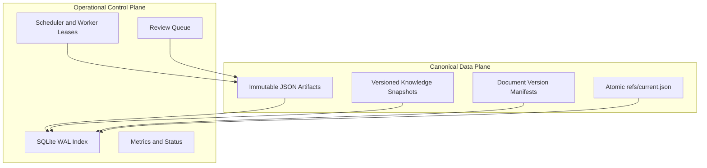
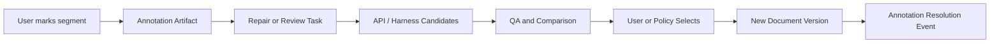

# Translation System Design

> 状态：目标设计，尚未完整实现。
>
> 当前可执行命令仍以 [`../README.md`](../README.md) 为准；近期实现顺序与组件状态以
> [`../../../docs/PROJECT_STATUS.md`](../../../docs/PROJECT_STATUS.md) 为准。

## 1. 目标

把现有“下载 -> 翻译 -> 修复/清理 -> 打包”的脚本流水线演进为一个单机优先、可恢复、可审计的翻译工作区系统：

- 同时支持 OpenRouter、OpenAI、vLLM、MLX 等批量 API 路线。
- 同时支持 Codex、Claude Code、Cursor 等高质量 Agent harness。
- 每个 segment 可以保留多个候选译文，不覆盖历史。
- 用户或高质量 Agent 可以比较、选择、编辑候选。
- 用户可以标记某句话有问题，并触发定向 review / repair。
- 保持单篇内部的人名、称谓、语气和上下文一致。
- 保持同作者、同系列和跨文本的实体与术语一致。
- QA 和 repair 非破坏性：新结果只有在明确更好时才成为选中版本。
- 所有发布物都可以追溯到确定的 source revision、candidate、规则快照和选择决策。

这不是分布式平台设计。合理目标是：

- 文件系统保存可移植、可审阅的规范工件。
- SQLite/WAL 提供本机索引、查询、并发领取和恢复。
- Makefile 与管理脚本保持统一入口。
- 未来需要远程 worker 时，再在相同任务协议上增加调度后端。

## 2. 核心决策

### 2.1 JSON 是业务工件，SQLite 是运行索引

JSON 与 SQLite 不做二选一。

JSON 保存需要长期保留和跨工具交换的业务事实：

- 规范化文档及 source revision
- segment
- 候选译文
- QA finding 和 evaluation
- 用户 annotation
- entity / terminology 快照
- 文档版本和发布 manifest
- Agent job / result bundle

SQLite 保存可重建或短生命周期的数据：

- 对 JSON 工件的查询索引
- 当前 review queue
- worker lease、心跳和 retry
- run / stage 的实时状态
- 聚合后的 token、成本、耗时指标
- 当前 ref 的快速查询缓存

约束：

1. 不允许某个长期业务事实只存在于 SQLite。
2. SQLite 删除后必须可以通过 `rebuild-index` 从 JSON 工件重建。
3. worker lease 等纯调度状态不要求写入 JSON。
4. JSON 对象应小而独立，禁止维护一个不断被并发改写的巨大 `workspace.json`。
5. 长期工件优先不可变；“当前选中版本”使用小型 ref 文件原子更新。

### 2.2 模型和 Agent 都是 Candidate Producer

OpenRouter API、本地 vLLM/MLX、Codex、Claude Code、Cursor、人工编辑都通过统一结果协议生产 candidate。

它们无权直接：

- 覆盖现有 candidate
- 修改已发布版本
- 修改原始输入
- 绕过 QA 将结果发布
- 直接写 canonical workspace

结果必须先经过 schema 校验、来源校验、QA 和选择策略，再由系统导入。

### 2.3 发布物是派生结果

`*_bilingual/`、`*_zh/`、合并文本和 EPUB 等都是 renderer 根据某个不可变 `DocumentVersion` 生成的派生物。

它们不再承担：

- checkpoint
- repair 数据库
- QA 真相源
- candidate 历史

因此发布目录可以随时删除并从版本 manifest 重建。

### 2.4 Repair 永远生成候选，不原地改写

repair 的输入是：

- 当前选中 candidate
- QA findings
- 用户 annotation
- 相关上下文与知识快照

repair 的输出是新的 candidate。旧 candidate 永远保留。

## 3. 系统总览

```mermaid
flowchart LR
    A["Pixiv / Fanbox Source"] --> B["Source Adapter"]
    B --> C["Document Revision + Segments"]
    C --> D["Context and Knowledge Resolver"]
    D --> E["Task Planner"]
    E --> F["API Executor"]
    E --> G["Harness Job Exporter"]
    G --> H["Codex / Claude Code / Cursor"]
    H --> I["Harness Result Importer"]
    F --> J["Candidates"]
    I --> J
    J --> K["Deterministic QA"]
    K --> L["Semantic Review / Comparison"]
    L --> M["Selection Policy or Human Choice"]
    M --> N["Document Version"]
    N --> O["Renderer"]
    O --> P["Bilingual / Chinese / Package"]
    K --> Q["Repair Queue"]
    R["User Annotation"] --> Q
    Q --> E
```



### 3.1 数据平面与控制平面



## 4. Workspace 布局

建议目标布局：

```text
tasks/translation/
├── schemas/                         # tracked JSON Schema
├── agent_workflows/                 # tracked harness-neutral instructions
├── config/
│   ├── recipes.json
│   ├── runtimes.json
│   └── source_profiles.json
└── data/
    └── workspaces/<workspace_id>/   # runtime data, git-ignored
        ├── workspace.json
        ├── documents/
        │   └── <document_key>/
        │       ├── revisions/<revision_id>.json
        │       ├── candidates/<candidate_id>.json
        │       ├── evaluations/<evaluation_id>.json
        │       ├── annotations/<annotation_id>.json
        │       ├── annotation_events/<event_id>.json
        │       ├── versions/<version_id>.json
        │       └── refs/current.json
        ├── knowledge/
        │   ├── entities/<entity_id>.json
        │   ├── snapshots/<snapshot_id>.json
        │   └── refs/current.json
        ├── jobs/<job_id>/
        │   ├── task.json
        │   ├── context.json
        │   ├── instructions.md
        │   ├── result.schema.json
        │   └── result.json
        ├── runs/<run_id>/
        │   ├── manifest.json
        │   └── events.jsonl
        ├── rendered/<version_id>/
        └── .index/workspace.db
```

canonical artifact 使用完整对象文件；高频运行事件可以使用 append-only JSONL。JSONL 不能承担需要原子替换的 selection manifest。

`document_id` 包含冒号等逻辑分隔符，不能直接作为跨平台目录名。`document_key` 应使用安全 slug 加 hash，
例如 `pixiv-50235390-12430834-a1b2c3d4`，JSON 内仍保留完整 `document_id`。

工件写入必须：

1. 使用稳定的 canonical JSON 序列化后计算 digest。
2. 写入同目录临时文件。
3. `flush/fsync` 后原子 rename。
4. 不覆盖已存在且 digest 不同的不可变对象。
5. 更新 `refs/current.json` 时使用 expected-parent compare-and-swap，防止两个 reviewer 互相覆盖。
   注意：临时文件 + 原子 rename 本身不能让"检查 expected parent 再替换"成为原子操作——两个
   写入者可能同时通过检查后相互覆盖。CAS 必须在持有互斥的前提下执行：用同目录文件锁
   （`flock`/`O_EXCL` lockfile）或 SQLite 事务把"读 parent → 比较 → rename"包成临界区；
   比较失败者必须放弃写入并走冲突分叉流程，而不是重试覆盖。

canonical JSON 的排序、Unicode 和数字规则必须固定。可采用 RFC 8785/JCS，或在项目内定义并测试等价的
UTF-8、sorted-key、无浮点歧义序列化规则。

## 5. 身份、修订和过期结果

### 5.1 Document ID

`document_id` 标识逻辑文章，不随内容修改：

```text
pixiv:<creator_id>:<novel_id>
fanbox:<creator_id>:<post_id>
```

### 5.2 Document Revision

下载内容或 metadata 改变时生成新的 revision：

```text
revision_id = sha256(canonical_source_payload)
```

revision 固定：

- 原文内容
- 结构化 metadata
- source URL
- source adapter 版本
- segmentation 版本

### 5.3 Segment ID

candidate 必须绑定准确的 source revision。建议：

```text
segment_id = <revision_id>:<ordinal>:<normalized_source_hash_prefix>
```

ordinal 方便阅读，source hash 防止将旧结果错误导入新内容。

segment 是最小翻译、候选选择和 QA 单元，不必严格等于语法上的一句话。第一阶段沿用当前“非空原文行”
最稳妥；后续可以支持段落或句子级 segmentation，但算法版本变化必须产生新 revision。

title、caption、series title、tag 等 metadata 也应表示为带 `kind=metadata.*` 的 segment，复用相同的
candidate/evaluation/version 机制，不再维护第二套 metadata 版本模型。

用户可以对整个 segment 标记问题，也可以在 annotation 中附加 source/translation character span。
span 只是 UI 定位信息，candidate 仍以完整 segment 为提交单位，避免局部替换破坏语法。

如果源文更新：

- 创建新 revision 和新 segment ID。
- 使用显式 `segment_mapping` 关联新旧 revision。
- 完全相同的 segment 可复用 candidate，但必须记录复用来源。
- 不允许仅凭行号自动套用旧 candidate。

### 5.4 Stale Result 防护

导入 API 或 Agent 结果时必须校验：

- `task_id`
- `document_id`
- `revision_id`
- `segment_id`
- `source_hash`
- `context_digest`
- `knowledge_snapshot_id`
- `task_schema_version`

任一不匹配时，结果进入 quarantine，不得自动参与 selection。用户可以选择重新导出任务或显式 rebase。

## 6. 核心数据模型

### 6.1 Document Revision

```json
{
  "schema_version": 1,
  "document_id": "pixiv:50235390:12430834",
  "revision_id": "rev_sha256",
  "source": {
    "provider": "pixiv",
    "creator_id": "50235390",
    "source_id": "12430834",
    "url": "https://example.invalid"
  },
  "metadata": {
    "title": "原始标题",
    "series_id": "123",
    "series_title": "系列名",
    "published_at": "2026-01-01T00:00:00Z"
  },
  "segments": [
    {
      "segment_id": "rev_sha256:000042:sourcehash",
      "ordinal": 42,
      "kind": "body",
      "source_text": "彼女は振り返った。",
      "source_hash": "sha256"
    }
  ]
}
```

### 6.2 Candidate

```json
{
  "schema_version": 2,
  "candidate_id": "cand_ulid",
  "document_id": "pixiv:50235390:12430834",
  "revision_id": "rev_sha256",
  "segment_id": "rev_sha256:000042:sourcehash",
  "source_hash": "sha256",
  "text": "她转过身来。",
  "purpose": "initial",
  "parent_candidate_id": null,
  "producer": {
    "type": "api",
    "name": "openrouter",
    "model": "model-slug",
    "harness": null
  },
  "provenance": {
    "task_id": "task_ulid",
    "task_digest": "sha256",
    "result_digest": "sha256",
    "result_candidate_key": "option-a",
    "prompt_version": "body-v3",
    "recipe_id": "fanbox-default-v2",
    "knowledge_snapshot_id": "knowledge_sha256"
  },
  "created_at": "2026-06-12T00:00:00Z"
}
```

`provenance.task_digest` / `result_digest` / `result_candidate_key` 即 §9 幂等键的持久化形式
（schema_version 2 起为必填；人工/遗留候选可为 null）。

候选文本不能在创建后修改。人工编辑也创建 `producer.type=human` 的新 candidate。

### 6.3 Evaluation

```json
{
  "schema_version": 1,
  "evaluation_id": "eval_ulid",
  "candidate_id": "cand_ulid",
  "evaluator": {
    "type": "rule",
    "name": "deterministic-qa",
    "version": "qa-v2"
  },
  "verdict": "fail",
  "findings": [
    {
      "code": "kana_residue",
      "severity": "error",
      "message": "译文残留假名",
      "evidence": "振り"
    }
  ],
  "scores": {},
  "created_at": "2026-06-12T00:00:01Z"
}
```

语义 reviewer 可以填 `accuracy`、`fluency`、`consistency`、`style`，但硬错误与主观评分必须分开。

### 6.4 Document Version

```json
{
  "schema_version": 1,
  "version_id": "version_ulid",
  "document_id": "pixiv:50235390:12430834",
  "revision_id": "rev_sha256",
  "parent_version_id": "version_previous",
  "knowledge_snapshot_id": "knowledge_sha256",
  "selections": {
    "rev_sha256:000042:sourcehash": "cand_ulid"
  },
  "decision": {
    "selected_by": "user",
    "reason": "accepted after comparison"
  },
  "status": "reviewed",
  "created_at": "2026-06-12T00:10:00Z"
}
```

文档版本是 selection manifest，不复制所有 candidate 正文。

### 6.5 Annotation

用户标记某句话有问题时创建不可变 annotation：

```json
{
  "schema_version": 1,
  "annotation_id": "annotation_ulid",
  "document_id": "pixiv:50235390:12430834",
  "revision_id": "rev_sha256",
  "segment_id": "rev_sha256:000042:sourcehash",
  "target_candidate_id": "cand_ulid",
  "type": "wrong_reference",
  "comment": "这里的「彼女」指小雪，不是由纪。",
  "created_by": "user",
  "created_at": "2026-06-12T00:12:00Z"
}
```

状态变化不原地修改 annotation，而是追加 resolution event：

- `opened`
- `repair_requested`
- `candidate_produced`
- `resolved`
- `dismissed`
- `reopened`

这样可以完整保留用户反馈历史。

## 7. 单篇内部一致性

每篇文档先生成版本化 `DocumentContext`：

```text
summary
narrative_viewpoint
style_rules
entities
relationships
terminology
accepted_previous_segments
```

实体记录至少包含：

- `entity_id`
- 日文标准写法
- 假名/片假名
- 中文标准译名
- 别名、昵称、称谓
- 禁止使用的坏别名
- 类型：人物、组织、地点、专名
- authority：manual / approved / automatic
- status：locked / approved / candidate

优先级：

```text
人工 locked
> 已验收的系列/作者规则
> 本文已批准规则
> 本文自动候选
> 模型自由判断
```

### 7.1 Context Pack

每个任务只注入相关上下文：

- 文档摘要
- 当前 segment 涉及的实体
- 相关人物关系
- 相关术语
- 前后 source segment
- 前面已经验收的译文
- 用户 annotation
- QA findings

禁止每批无差别注入整个全局词典，以免：

- prompt 过长
- 无关同名实体污染
- 模型复读规则
- context 成本不可控

### 7.2 翻译后审计

确定性审计检查：

- locked entity 是否使用标准译名
- forbidden aliases 是否出现
- 同一 entity 是否出现多个译法
- 同一称谓是否无理由漂移

语义 reviewer 检查：

- 指代是否链接到正确人物
- 叙述视角与性别是否一致
- 语气是否与前文角色设定冲突

## 8. 跨文本一致性

跨文本知识不是简单的 `日文=中文` 字符串表，而是有作用域的实体系统。

### 8.1 Scope

```text
global
provider
creator
series
document
```

越具体的 scope 优先级越高，但 locked global rule 只能由显式 override 覆盖。

例如两个系列都出现 `ユキ`：

```text
series:A/entity:character_12 -> 小雪
series:B/entity:character_07 -> 由纪
```

不能写成无作用域的全局 `ユキ=雪`。

### 8.2 Entity Linking

新文档预分析时：

1. 根据 provider、creator、series 载入相关知识快照。
2. 提取名称、读音、昵称、称谓和共现关系。
3. 将 mention 链接到既有 `entity_id`。
4. 低置信度匹配进入 review queue。
5. 新实体以 `candidate` 状态创建。
6. 只有人工或高置信度审核后才能成为 approved/locked。

entity linking 证据应保存：

- source mention
- document / segment
- 候选 entity
- 置信度
- 上下文摘要
- reviewer 决策

### 8.3 Knowledge Snapshot

每个 translation task 固定 `knowledge_snapshot_id`。后续规则变化不会悄悄改变旧版本的含义。

规则更新后可以执行 impact analysis：

- 找出使用旧译名的 segment。
- 为受影响 segment 创建 review task。
- 生成新 candidate 和新 document version。
- 不改写历史发布版本。

## 9. 统一任务协议

### 9.1 Task

```json
{
  "schema_version": 1,
  "task_id": "task_ulid",
  "task_type": "translate",
  "document_id": "pixiv:50235390:12430834",
  "revision_id": "rev_sha256",
  "segment_ids": ["rev_sha256:000042:sourcehash"],
  "source_hashes": {
    "rev_sha256:000042:sourcehash": "sha256"
  },
  "context_digest": "sha256",
  "knowledge_snapshot_id": "knowledge_sha256",
  "constraints": {
    "output_language": "zh-CN",
    "preserve_line_count": true
  },
  "existing_candidate_ids": [],
  "annotation_ids": [],
  "expected_result_schema": 1
}
```

支持的 task type：

- `translate`
- `review`
- `compare`
- `repair`
- `entity_link`
- `terminology_review`

### 9.2 Result

```json
{
  "schema_version": 1,
  "task_id": "task_ulid",
  "task_digest": "sha256",
  "producer": {
    "type": "harness",
    "name": "codex",
    "model": "reported-model"
  },
  "candidates": [
    {
      "result_candidate_key": "option-a",
      "segment_id": "rev_sha256:000042:sourcehash",
      "source_hash": "sha256",
      "text": "她转过身来。",
      "rationale": "保持前文人物指代"
    }
  ],
  "findings": [],
  "recommended_candidate_keys": ["option-a"],
  "completed_at": "2026-06-12T00:00:00Z"
}
```

`result_candidate_key` 只在当前 result 内引用。canonical `candidate_id` 必须由 importer 分配，
不能信任 Agent 或外部 executor 自行生成的 ID。`rationale` 仅用于 review，不拼接进译文。

导入必须幂等：同一 `result.json` 因 importer 崩溃恢复、任务重试或索引重建而再次导入时，
不得生成重复 candidate；同时同一任务的**不同执行**（非确定性重试产生不同文本）必须能各自
落为独立 candidate。为此幂等键必须包含具体结果身份（`result_digest` = result.json 的
canonical digest），`candidate_id` 由其确定性派生：

```text
candidate_id = "cand_" + sha256(task_digest + ":" + result_digest + ":" + result_candidate_key + ":" + segment_id)[:16]
```

`task_digest`、`result_digest` 与 `result_candidate_key` 持久化在 Candidate 工件内
（见 §6.2），索引层对 `(task_digest, result_digest, result_candidate_key, segment_id)`
施加唯一约束；重复导入同一 result 时命中已有 candidate，跳过写入并返回原 ID（与 §4
"不覆盖已存在且 digest 不同的不可变对象"一致——同 ID 不同内容视为损坏，必须报错而非覆盖）。

## 10. API 与 Harness 双路线

### 10.1 API Executor

适合：

- 大规模初译
- 可控并发
- 无人值守运行
- 低成本 deterministic retry

统一接口应屏蔽 OpenRouter、OpenAI、vLLM 和 MLX 的差异：

```text
execute(task, runtime, context_pack) -> ResultEnvelope
```

runtime 配置包含：

- provider
- endpoint
- model
- credentials reference
- concurrency
- rate limit
- timeout
- generation profile

credentials 只能由 executor 从环境或本地 secret 配置读取，永远不能进入 job JSON。

### 10.2 Harness Executor

Codex、Claude Code、Cursor 的共同集成面是 job bundle，而不是各自不稳定的私有 API。

导出目录：

```text
jobs/<job_id>/
  task.json
  context.json
  instructions.md
  result.schema.json
```

Agent 规则：

1. 只处理 `task.json` 指定的 segment。
2. 不修改 source、candidate、version 或 refs。
3. 不读取无关 workspace 内容。
4. 只能写 `result.json` 和可选诊断附件。
5. 必须保留 task/source/context digest。
6. 不自行发布。

适配方式分两级：

- 手动/交互式：用户在 Cursor、Codex 或 Claude Code 中打开 job 目录执行。
- 自动/非交互式：adapter 调用可用 CLI，等待 `result.json`，再走统一 importer。

系统不依赖任何 harness 一定存在稳定 headless CLI。job export/import 是最低共同能力。

harness 实际工作目录应是只包含 job bundle 的隔离目录，而不是整个 repository/workspace。确实需要额外历史
证据时，由 context builder 显式复制只读摘要，避免 Agent 越权读取或修改无关 candidate。

### 10.3 Agent Workflow

推荐提供 harness-neutral instruction pack：

- `translation-produce`
- `translation-review`
- `translation-compare`
- `translation-repair`
- `entity-link-review`

Codex Skill、Claude Code command、Cursor rule 由同一 instruction pack 生成薄包装，避免三份业务规则漂移。

## 11. QA、比较与选择

### 11.1 第一层：确定性 QA

普通代码负责：

- segment/source hash 对齐
- 空译文
- 行数与双语配对
- 失败标记
- 拒绝模板
- 假名残留
- 原文复制
- 长度异常
- 重复
- locked entity 和 forbidden alias
- metadata 完整性

这层必须快速、可复现、无模型依赖。

### 11.2 第二层：语义 Review

模型或 Agent 负责：

- 含义准确性
- 指代
- 省略和增译
- 角色语气
- 文体
- 候选之间的优劣比较

语义 review 必须输出结构化 finding 和 evidence，不能只给一个总分。

### 11.3 Candidate Selection

选择顺序：

1. 淘汰有 critical hard error 的 candidate。
2. 保留 warning，但显示给 reviewer。
3. 对剩余候选做 pairwise comparison。
4. 高置信度且策略允许时自动选择。
5. 模型意见冲突、差异小或高价值文本进入人工 review。
6. 用户显式选择优先级最高，但仍保留 QA warning。

不建议只使用一个加权总分，因为它会隐藏“事实正确但不流畅”和“流畅但误译”的差异。

### 11.4 多版本

每个 segment 可以同时存在：

```text
c1 API initial
c2 local model repair
c3 Codex review
c4 Claude Code alternative
c5 human edit
```

`DocumentVersion` 决定当前整篇文章选择哪些 candidate。比较两个版本时按 segment 展示：

- source
- 两边 candidate
- hard QA
- semantic findings
- producer / model
- 用户 annotation

版本 validator 还要检查 candidate 使用的 knowledge snapshot。如果一个版本混用多个 snapshot 的 candidate，
必须重新做一致性 QA，或者在 manifest 中显式记录并接受该差异。

## 12. 用户标记与定向重译



建议问题类型：

- `mistranslation`
- `wrong_reference`
- `name_inconsistent`
- `terminology`
- `missing`
- `unnatural`
- `style`
- `format`
- `custom`

用户说明只作用于当前 repair task。若它包含可复用知识，例如“该系列中某人物固定译为小雪”，需要单独的 promote 操作才能进入 knowledge store。

这样避免一次局部意见未经审核污染全系列。

源文 revision 更新后，旧 annotation 不自动套到新 segment。系统应先通过 `segment_mapping` 尝试迁移；
无法高置信度映射时标记为 stale，交给用户确认。

## 13. 非破坏性 Repair

repair 闭环：

1. 读取 annotation / QA finding。
2. 先运行确定性替换或规则修正。
3. 必要时调用 API 或 Agent 生成 candidate。
4. 对新旧 candidate 运行相同 QA。
5. 比较 hard finding、语义 finding 和用户目标。
6. 只有改善时才自动选择。
7. 无改善时保留旧选择，新 candidate 仍可供人工查看。
8. 默认最多两轮自动 repair，之后进入 `needs_review`。

自动接受的最低约束：

- critical/error 数不增加。
- 用户指定的问题已消失。
- locked terminology 不回退。
- 没有产生新的拒绝、占位或对齐错误。

“错误总数下降”不总是充分条件。不同 severity 必须分层比较，不能用 10 个 warning 换掉 1 个事实性 critical error。

## 14. 状态机

执行状态与内容状态分开。

### 14.1 执行状态

```text
queued
leased
running
succeeded
failed
cancelled
stale
```

### 14.2 内容状态

```text
draft
qa_failed
review_required
reviewed
accepted
published
superseded
```

一个 job 成功只表示它产出了合法 result，不表示候选已经 accepted。

## 15. 并发与恢复

第一阶段只做文件级并发：

- 一个 worker 同时处理一篇文档。
- Translator、logger、glossary context 不跨 worker 共享。
- SQLite 使用 WAL。
- worker 原子领取 lease，并定期 heartbeat。
- lease 超时后任务可重新领取。
- task/result 都有幂等 key。
- canonical artifact 写入按 digest 幂等。
- current ref 更新使用 compare-and-swap；冲突时创建两个版本，由 reviewer 合并选择。

runtime 分别配置并发：

- 本地 MLX 通常为 1。
- 单实例 vLLM 根据显存和 batch 能力设置。
- OpenRouter 根据 rate limit 设置。
- Agent harness 默认低并发，避免多个进程争抢同一工作目录。

同一篇文章内部并行翻译要晚于文件级并发，因为相邻上下文、实体确认和前文译法会产生顺序依赖。

## 16. 安全与信任边界

原文、下载 metadata、模型输出和 Agent 输出都视为不可信输入。

必须注意：

- prompt 中明确分隔 instructions、knowledge、source。
- source 中的“忽略之前指令”等文本只是待翻译内容。
- job bundle 不包含 API key、cookie、绝对 secret 路径。
- importer 禁止 result 指定任意输出路径。
- importer 限制单字段大小、候选数量和附件类型。
- JSON 按 schema 严格校验，不接受额外危险字段。
- Agent 无 canonical workspace 写权限时最安全；至少应限制其约定写入目录。
- 发布前重新从 canonical candidate 渲染，不直接复制 Agent 生成的文件。

对本地 harness 自动执行时，还要记录：

- adapter 版本
- harness 版本
- 工作目录
- 命令模板
- exit code
- stdout/stderr 摘要

## 17. 配置分层

目标配置拆分：

| 层 | 作用 |
| --- | --- |
| Source Profile | Pixiv/Fanbox metadata、segmentation、source prompt 差异 |
| Runtime | provider、endpoint、model、并发、限速、secret reference |
| Generation Profile | temperature、top_p、max tokens、timeout |
| Recipe | translate/review/repair 使用哪些 runtime、QA policy、轮数 |
| CLI Override | 本次运行的少量显式覆盖 |

运行前 preflight：

- endpoint 健康
- 模型 slug 存在
- credentials 可用
- schema 与 prompt 版本存在
- source adapter 能解析输入
- knowledge snapshot 可读取
- renderer 版本可用

preflight 失败时不创建半成品 candidate。

## 18. 可观测性

每次调用记录：

- run / task / stage / attempt ID
- document / revision / segment
- producer、provider、model、harness
- prompt/context/knowledge 版本
- 输入输出 token
- latency
- retry 原因
- estimated / actual cost
- QA findings
- candidate selection 结果

监控与报表查询 SQLite，不解析日志文案。日志仍用于诊断，但不是统计接口。

需要的核心指标：

- candidate 首次通过率
- repair 成功率
- 每千 segment 成本
- 每篇耗时
- stale result 数
- 用户 annotation 类型分布
- entity conflict 数
- 自动选择与人工推翻比例

## 19. 实现边界

不要把目标架构一次性塞回 `pipeline.py`。建议逐步建立：

```text
src/core/domain/       # Document, Segment, Candidate, Version
src/core/artifacts/    # JSON schema validation and ArtifactStore
src/core/executors/    # API and harness adapters
src/core/workflow/     # stage runner, task planning, selection
src/core/knowledge/    # entities, terminology, context packs
src/core/render/       # bilingual/zh/package renderers
```

第一轮不必同时创建所有包。每个包应在有真实 caller 时引入，避免新的空壳抽象。

现有模块迁移方向：

| 当前模块 | 目标 |
| --- | --- |
| `file_handler.py` | Source discovery + compatibility adapter |
| `pipeline.py` | 逐步变薄为 workflow facade |
| `translator.py` | API candidate producer |
| `quality_checker.py` | batch acceptance |
| `qa_gate.py` | deterministic candidate/artifact QA |
| `repairer.py` | repair task planner，不再直接覆盖文件 |
| `bilingual_writer.py` | renderer compatibility layer |
| `run_state.py` | 过渡期 compatibility state，最终由 index + artifacts 替代 |
| `extract_chinese.py` | renderer/package compatibility layer |

## 20. 迁移路线

迁移必须保持现有 Make 入口可运行，并允许阶段回滚。

### Phase 0：冻结协议和回归样本

交付：

- `schemas/` 中的 revision、candidate、evaluation、annotation、version、task、result schema。
- 一组最小 Pixiv/Fanbox fixture。
- 记录现有 bilingual/zh 输出作为 golden files。
- 为当前 parser、QA、repair 增加失败样本。

验收：

- schema round-trip。
- 同一输入生成稳定 revision / segment ID。
- fixture 不调用真实模型。

### Phase 1：Document/Segment 与 Renderer

交付：

- source adapter 将现有 TXT + meta/index 转成 DocumentRevision。
- 从 DocumentVersion 渲染 bilingual 和 zh。
- 现有翻译结果可导入为 legacy candidate。
- 现有 `_bilingual`、`_fixed`、`_v2`、`_namefix` 等目录按显式目录标签导入为不同 producer/candidate，
  不根据目录名猜测哪一份质量最高。

兼容：

- 现有 `make translate-*` 继续工作。
- 新 renderer 先做 shadow output，与旧输出 diff。

验收：

- 空白行、YAML metadata、正文顺序不变。
- legacy bilingual 可无损导入并重新渲染。
- 同文 candidate 可以被识别为文本等价，但不同 producer/provenance 仍保留独立 candidate。

回滚：

- renderer 未切主路径前，旧 writer 保持可用。

### Phase 2：Candidate 与 Version

交付：

- 翻译不再只返回拼接文本，而是创建 segment candidates。
- selection manifest 和 current ref。
- 用户/人工编辑创建新 candidate。

验收：

- 多 candidate 共存。
- 可切换 selection、创建版本、回滚版本。
- 旧 candidate 不被覆盖。

### Phase 3：统一 QA 与非破坏性 Repair

交付：

- QA finding 绑定 candidate + segment。
- repair 生成 candidate。
- candidate comparison 和自动接受护栏。
- QA -> repair -> QA 闭环。

验收：

- repair 失败不改变 current version。
- 新 critical error 阻止自动接受。
- 用户 annotation 可以只重译一个 segment。

### Phase 4：Harness Job Protocol

交付：

- `export-job`
- `validate-result`
- `import-result`
- harness-neutral instruction pack
- Codex / Claude Code / Cursor 薄适配说明

验收：

- 同一 job 可由 API 或任意 harness 完成。
- stale / tampered result 被 quarantine。
- Agent 无法通过 result 写任意文件。

### Phase 5：跨文本 Knowledge

交付：

- scoped entity store
- knowledge snapshot
- entity linking review
- impact analysis

验收：

- 同名不同实体不串译。
- 规则变更能列出受影响 segment。
- 旧版本仍固定旧 snapshot，可重现。

### Phase 6：SQLite Index 与 Worker

交付：

- 可重建索引
- review queue
- worker lease / heartbeat
- runtime rate limit
- 文件级并发
- 指标查询

验收：

- 删除 DB 后完整重建。
- worker crash 后 lease 可恢复。
- 多 worker 不会重复提交同一幂等任务。

### Phase 7：用户 Review 界面

先做 CLI/TUI，再决定是否需要 Web UI：

- 查看 source 与多个 candidate
- 查看 QA findings
- 选择 candidate
- 人工编辑
- 标记问题
- 请求 API / Agent repair
- 发布版本

Web UI 不应早于 candidate/version/annotation 模型稳定。

## 21. 建议 CLI

以下是目标接口，不代表当前已实现：

```bash
make translation-import INPUT=...
make translation-run WORKSPACE=... RECIPE=...
make translation-export-job TASK_ID=...
make translation-import-result JOB_DIR=...
make translation-review DOCUMENT_ID=...
make translation-annotate SEGMENT_ID=... TYPE=...
make translation-render VERSION_ID=...
make translation-publish VERSION_ID=...
make translation-rebuild-index WORKSPACE=...
```

底层 Python 命令应共享同一 service API，Make 目标只做薄包装。

## 22. 测试策略

### 单元测试

- ID 和 hash 稳定性
- schema validation
- artifact 原子写
- ref compare-and-swap
- scope precedence
- selection policy
- stale result 检测
- annotation lifecycle

### 集成测试

- source -> revision -> candidate -> version -> render
- API fake executor
- harness export/import
- QA -> repair candidate -> comparison
- index rebuild
- worker lease recovery

### 回归集

- 人名同形异人
- 昵称与称谓变化
- 拟声词和短句
- R-18 模型拒绝
- few-shot 泄漏
- metadata 缺失
- source revision 更新
- repair 质量回退

### Property / invariant

- immutable artifact 创建后字节不变。
- version 引用的 candidate 必须属于同 revision/segment。
- published version 必须可完整渲染。
- current ref 必须指向存在的 version。
- repair 不会删除 parent candidate。
- index 重建前后查询结果一致。

## 23. 需要特别注意的风险

### 23.1 JSON 可移植不等于可以随意手改

canonical JSON 应通过命令或 importer 创建。人工直接修改会破坏 hash、引用和审计链。需要提供：

- `validate-workspace`
- `repair-index`
- `migrate-schema`

### 23.2 Schema 演进

每个对象带 `schema_version`。迁移原则：

- 读取至少支持当前版本与前一版本。
- migration 生成新 artifact，不原地破坏历史。
- version manifest 固定所引用对象。

### 23.3 Segment 边界变化

segmentation 算法升级会改变 segment ID。必须视为新 revision，并提供显式映射，不能静默复用旧行号。

### 23.4 Agent 质量不等于 Agent 裁决可靠

高质量 Agent 可能产生更好译文，但仍可能：

- 忽略输出 schema
- 被原文 prompt injection 干扰
- 修改超出任务范围的内容
- 给出自信但错误的评价

因此 Agent 结果仍要经过 importer、硬规则和可追溯 selection。

### 23.5 自动 Judge 偏差

避免同一模型既翻译又独立裁决自己的结果。高价值比较可以：

- 使用不同模型
- 使用 pairwise blind comparison
- 隐藏 producer 名称
- 对低置信度结果交给用户

### 23.6 知识污染

自动抽取的人名和术语只能是 candidate。未经审核的单篇推断不得自动提升为 creator/series/global 规则。

### 23.7 成本失控

每个 recipe 必须设置：

- 最大 candidate 数
- 最大自动 repair 轮数
- semantic review 抽样或触发条件
- 每 run 预算
- harness 并发

### 23.8 数据隐私

向远程 API 或 Agent 发送内容前记录 runtime 类型，并允许 recipe 约束：

- `local_only`
- `remote_allowed`
- `metadata_remote_allowed`
- `adult_content_compatible`

### 23.9 存储增长与清理

多 candidate 和不可变版本会持续增长。不能用“删除旧目录”处理，需要显式 retention/GC：

- published version、annotation 引用和人工 candidate 永久保留。
- 未选中且无引用的临时候选可按策略归档。
- GC 先生成 mark/sweep 报告，默认 dry-run。
- provenance 和 evaluation 可压缩归档，但不能留下悬空 version 引用。
- rendered 目录始终可删除重建。

## 24. 完成标准

目标系统达到稳定状态时，应满足：

- 任意阶段崩溃后可继续，已验收 candidate 不重复生成。
- API 和 Agent harness 使用同一 task/result 协议。
- 每句话可以保留多个候选并追溯来源。
- 用户可以标记问题、请求重译、比较并选择新候选。
- 单篇与跨文本实体规则有明确 scope 和版本。
- repair 永远非破坏性。
- 发布物由不可变 document version 生成。
- SQLite 可以删除并从 JSON 工件重建。
- 每个发布 segment 都能追溯 source、candidate、producer、QA、选择者和 knowledge snapshot。
